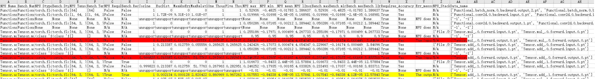
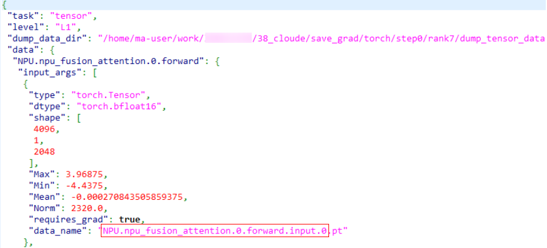

# PyTorch场景精度比对

## 简介

- 本节主要介绍通过命令行和比对函数的方式进行 CPU 或 GPU 与 NPU 的精度数据比对，执行精度比对操作前需要先完成 CPU 或 GPU 与 NPU 的精度数据 dump，参见《[PyTorch场景精度数据采集](../dump/pytorch_data_dump_instruct.md)》。

- msprobe 使用子命令 compare 进行比对，可支持单卡和多卡场景的精度数据比对。

- 比对函数均通过单独创建精度比对脚本执行，可支持单卡和多卡场景的精度数据比对。

- 工具性能：比对数据量较小时（单份文件小于 10 GB），比对速度 0.1 GB/s；比对数据量较大时，速度 0.3 GB/s。 推荐环境配置：独占环境，CPU 核心数 192，固态硬盘（IO 速度参考：固态硬盘 > 500 MB/s，机械硬盘 60 ~ 170 MB/s）。用户环境性能弱于标准约束或非独占使用的比对速度酌情向下浮动。比对速度的计算方式：两份比对文件大小/比对耗时。

**使用场景**

- 同一模型，从 CPU 或 GPU 移植到 NPU 中存在精度下降问题，对比 NPU 芯片中的 API 计算数值与 CPU 或 GPU 芯片中的 API 计算数值，进行问题定位。
- 同一模型，进行迭代（模型、框架版本升级或设备硬件升级）时存在的精度下降问题，对比相同模型在迭代前后版本的 API 计算数值，进行问题定位。
- 以上两个场景下，当存在无法自动匹配的API和模块时，则通过用户手动指定可以比对的API或模块来自定义映射关系，进行比对。

**注意事项**

- NPU 自研 API，在 CPU 或 GPU 侧若没有对应的 API，该 API 的 dump 数据不比对。
- NPU 与 CPU 或 GPU 的计算结果误差可能会随着模型的执行不断累积，最终会出现同一个 API 因为输入的数据差异较大而无法比对的情况。
- CPU 或 GPU 与 NPU 中两个相同的 API 会因为调用次数不同导致无法比对或比对到错误的 API，不影响整体运行，该 API 忽略。

**API 匹配条件**

进行精度比对时，需要判断 CPU 或 GPU 的 API 与 NPU 的 API 是否可以比对，须满足以下匹配条件：

- 两个 API 的名称相同，API 命名规则：`{api_type}.{api_name}.{api调用次数}.{正反向}.{输入输出}.{index}`，如：Functional.conv2d.1.backward.input.0。
- 两个 API 输入输出的 Tensor 数量相同。

通常满足以上两个条件，工具就认为是同一个 API，成功进行 API 的匹配，后续进行相应的计算。

## 使用前准备

**环境准备**

安装msProbe工具，详情请参见《[msProbe安装指南](../msprobe_install_guide.md)》。

**约束**

仅支持PyTorch场景。

## 精度比对功能介绍

### 功能说明
使用命令行工具对精度数据进行比对，输出比对结果。

### 注意事项
无

### 命令格式

```shell
msprobe compare -tp <target_path> -gp <golden_path> [options]
```

### 参数说明
| 参数名                                | 说明                                                                                                                                                                                | 是否必选 |
|------------------------------------|-----------------------------------------------------------------------------------------------------------------------------------------------------------------------------------| -------- |
| -tp或--target_path                  | NPU环境下的dump.json路径（单卡场景）或dump目录（多卡场景），str 类型。                                                                                                                                     | 是       |
| -gp或--golden_path                  | CPU、GPU或NPU环境下的dump.json路径（单卡场景）或dump目录（多卡场景），str 类型。                                                                                                                             | 是       |
| -o或--output_path                   | 配置比对结果文件存盘目录，str 类型，默认在当前目录创建output目录。文件名称基于时间戳自动生成，格式为：`compare_result_{timestamp}.xlsx`。<br>提示：output目录下与结果文件同名的文件将被删除覆盖。                                                       | 否       |
| -fm或--fuzzy_match                  | 模糊匹配。开启后，对于网络中同一层级且命名相同仅调用次数不同的 API，可匹配并进行比对。通过直接配置该参数开启，默认未配置，表示关闭。                                                                                                              | 否       |
| -dm或--data_mapping                 | 自定义映射关系比对。需要指定自定义映射文件*.yaml。自定义映射文件的格式请参见[自定义映射文件](#自定义映射文件)。仅[API和模块无法自动匹配场景](#API和模块无法自动匹配场景)需要配置。仅支持逐卡比对。                                                                      | 否       |
| -cm或--cell_mapping                 | 不同平台、不同配置的模块比对。配置该参数时表示开启不同平台、不同配置的模块比对功能，可以指定自定义映射文件*.yaml，不指定映射文件表示不映射比对。自定义映射文件的格式请参见[自定义映射文件（cell_mapping）](#自定义映射文件cell_mapping)。仅[不同平台、不同配置下的模块比对场景](#不同平台、不同配置下的模块比对)需要配置。 | 否       |
| -da或--diff_analyze                 | 自动识别网络中首差异节点，支持md5、统计量等dump数据。支持单卡/多卡场景。通过直接配置该参数开启，默认未配置，表示关闭。                                                                                                                   | 否       |
| -tensor_log或--is_print_compare_log | 配置是否开启单个模块或API的日志打印，仅支持msProbe工具dump的tensor数据。通过直接配置该参数开启，默认未配置，表示关闭。                                                                                                             | 否       |

### 使用示例

#### 整网比对场景

整网比对场景是包含：CPU 或 GPU 与 NPU环境的 API 计算数值的整网数据比对；相同模型不同迭代版本的 API 计算数值的整网数据比对。

支持单卡和多卡，可同时比对多卡的 dump 数据。多机场景需要每个设备单独执行比对操作。

1. 参见《[PyTorch场景精度数据采集](../dump/pytorch_data_dump_instruct.md)》完成 CPU 或 GPU 与 NPU 的精度数据 dump。

2. 运行命令示例：

   单卡场景：
   ```shell
   msprobe compare -tp /target_dump/dump.json -gp /golden_dump/dump.json -o ./output
   ```
   多卡场景(-tp和-gp需填写到step层级，即rank的上一层级)：
   ```shell
   msprobe compare -tp /target_dump/step0 -gp /golden_dump/step0 -o ./output
   ```
   
3. 查看比对结果，请参见 [精度比对结果分析](#精度比对结果分析)。

#### API和模块无法自动匹配场景

当存在无法自动匹配的API和模块时，则用户可以通过提供自定义映射关系的配置文件来告知工具可匹配的API或模块，进行比对。

1. [config.json](../../python/msprobe/config.json)文件level配置为L0或L1、task配置为tensor或statistics并指定需要dump的API或模块名。

2. 参见《[PyTorch场景精度数据采集](../dump/pytorch_data_dump_instruct.md)》完成 CPU 或 GPU 与 NPU 的精度数据 dump。

3. 运行命令：

   ```shell
   msprobe compare -tp /target_dump/dump.json -gp /golden_dump/dump.json -o ./output -dm data_mapping.yaml
   ```

   data_mapping.yaml文件配置请参见[自定义映射文件（data_mapping）](#自定义映射文件data_mapping)。

   该场景不支持-fm模糊匹配。

4. 查看比对结果，请参见 [精度比对结果分析](#精度比对结果分析)。

#### 不同平台、不同配置下的模块比对

1. 配置[config.json](../../../python/msprobe/config.json)文件level配置为L0、task配置为tensor或statistics。

2. 参见《[PyTorch场景精度数据采集](../dump/pytorch_data_dump_instruct.md)》完成 CPU 或 GPU 与 NPU 的精度数据 dump。

3. 执行如下示例命令进行比对：

   ```shell
   msprobe compare -tp /target_dump/dump.json -gp /golden_dump/dump.json -o ./output -cm cell_mapping.yaml
   ```
   cell_mapping.yaml文件配置请参见[自定义映射文件（cell_mapping）](#自定义映射文件cell_mapping)。

#### 首差异算子节点识别场景

首差异算子节点识别场景是指：XPU与NPU环境的网络中通过 `msprobe dump`保存数据的数据分析，找到网络精度问题中出现的首个差异算子节点。

支持单卡和多卡，可同时比对多卡的dump数据。

执行步骤：

1. [config.json](../../python/msprobe/config.json)文件level配置为L0或L1、task配置为tensor或statistics(也可设置 `summary_mode`为 `md5`)并指定需要dump的API或模块名。
2. 参见《[PyTorch场景精度数据采集](../dump/pytorch_data_dump_instruct.md)》完成 CPU 或 GPU 与 NPU 的精度数据 dump。
3. 运行命令:
   单卡场景：
   ```shell
   msprobe compare -tp /target_dump/dump.json -gp /golden_dump/dump.json -o ./output -da
   ```
   多卡场景(-tp和-gp需填写到step层级，即rank的上一层级)：
   ```shell
   msprobe compare -tp /target_dump/step0 -gp /golden_dump/step0 -o ./output -da
   ```

4. 查看比对结果，在用户指定输出目录下会生成`compare_result_rank{rank_id}_{timestamp}.json`以及`diff_analyze_{timestamp}.json`。
    - 目录结构：
        ```
        output/
        ├── compare_result_rank0_{timestamp}.json
        ├── compare_result_rank1_{timestamp}.json
        ├── diff_analyze_{timestamp}.json
        ```

    - `compare_result_rank{rank_id}_{timestamp}.json`：包含该rank比对结果，包括API或模块名、比对状态、比对指标等。
    - `diff_analyze_{timestamp}.json`：包含首差异算子节点识别结果，包括算子节点名、算子类型、算子位置等。


### 输出说明
比对完成则打印提示信息：msprobe compare ends successfully. 

- 单卡场景：在配置的输出路径中，生成.xlsx后缀的文件，文件名称基于时间戳自动生成，格式为：compare_result\_{timestamp}.xlsx。

- 多卡场景：在配置的输出路径中，生成多个.xlsx后缀的文件，文件名称基于时间戳自动生成，格式为：compare_result_rank{rank_id}_{timestamp}.xlsx。

- 首差异算子节点识别场景: 

  完成则打印：Saving json file to disk: /output_path/compare_result_rank{rank_id}\_{timestamp}.json和The analyze result is saved in: /output_path/diff_analyze\_{timestamp}.json

  在配置的输出路径中，生成多个.json后缀的文件，文件名称基于时间戳自动生成，格式为：compare_result_rank{rank_id}\_{timestamp}.json和diff_analyze\_{timestamp}.json。

### 输出结果文件说明

#### 精度比对结果分析

PyTorch 精度比对是以 CPU 或 GPU 的计算结果为标杆，通过计算精度评价指标判断 API 在运行时是否存在精度问题。

- `compare_result_{timestamp}.xlsx` 文件列出了所有执行精度比对的 API 详细信息和比对结果，示例如下：

  

- **提示**：比对结果通过、比对结果（Result）、错误信息提示（Err_Message）定位可疑算子，但鉴于每种指标都有对应的判定标准，还需要结合实际情况进行判断。

#### 指标说明

精度比对从三个层面评估 API 的精度，依次是：真实数据模式、统计数据模式和 MD5 模式。比对结果分别有不同的表头。

三种模式表示采集的不同类型数据。数据采集操作《[PyTorch场景精度数据采集](../dump/pytorch_data_dump_instruct.md)》。

真实数据模式：数据采集时配置config.json中task字段为"tensor"，落盘统计量和全量tensor。

统计数据模式：数据采集时配置config.json中task字段为"statistics"，summary_mode字段为"statistics"，仅落盘统计量。

MD5模式：数据采集时配置config.json中task字段为"statistics"，summary_mode字段为"md5"，仅落盘统计量和md5值。

**公共表头**：

|dump 数据模式|NPU Name (NPU 的 API 名)| Bench Name (Bench 的 API 名) |NPU Dtype (NPU 数据类型)| Bench Dtype (Bench 数据类型) |NPU Tensor Shape (NPU 张量形状)| Bench Tensor Shape (Bench 张量形状) | NPU Requires_grad (NPU tensor是否计算梯度) | Bench Requires_grad (Bench tensor是否计算梯度) |
|:-:|:-:|:--------------------------:|:-:|:------------------------:|:-:|:-------------------------------:|:------------------------------------:|:----------------------------------------:|
|真实数据模式|√|             √              |√|            √             |√|                √                |                  √                   |                    √                     |
|统计数据模式|√|             √              |√|            √             |√|                √                |                  √                   |                    √                     |
|MD5 模式|√|             √              |√|            √             |√|                √                |                  √                   |                    √                     |

**个性表头**：

统计量有 4 种：最大值（max）、最小值（min）、平均值（mean）和 L2-范数（L2 norm）。

|dump 数据模式|Cosine (tensor 余弦相似度)|EucDist (tensor 欧式距离)|MaxAbsErr (tensor 最大绝对误差)|MaxRelativeErr (tensor 最大相对误差)|One Thousandth Err Ratio (tensor 相对误差小于千分之一的比例)|Five Thousandth Err Ratio (tensor 相对误差小于千分之五的比例)| NPU 和 Bench 的统计量绝对误差 (max, min, mean, L2 norm) diff | NPU 和 Bench 的统计量相对误差 (max, min, mean, L2 norm) RelativeErr | NPU 和 Bench 的统计量 (max, min, mean, L2 norm) |NPU MD5 (NPU 数据 CRC-32 值)|BENCH MD5 (bench 数据 CRC-32 值)| Requires_grad Consistent (计算梯度是否一致) | Result (比对结果) |Err_message (错误信息提示)|NPU_Stack_Info (堆栈信息)| Data_Name ([NPU真实数据名，Bench真实数据名]) |
|:---:|:---:|:---:|:---:|:---:|:---:|:---:|:---------------------------------------------------:|:----------------------------------------------------------:|:------------------------------------------:|:---:|:---:|:-----------------------------------:|:-------------:|:---:|:---:|:---------------------------------:|
|真实数据模式|√|√|√|√|√|√|                                                     |                                                            |                     √                      |||                  √                  | √ |√|√|                 √                 |
|统计数据模式|||||||                          √                          |                             √                              |                     √                      |||                  √                  |       √       |√|√|                                   |
|MD5 模式|||||||                                                     |                                                            |                                            |√|√|                  √                  |      √        |√|√|                                   |


#### 比对指标计算公式

$N$: NPU侧tensor

$B$: Bench侧tensor

RE(Relative Error， 相对误差): $\vert\frac {N-B} {B}\vert$  

真实数据模式：

Cosine: $\frac {{N}\cdot{B}} {{\vert\vert{N}\vert\vert}_2{\vert\vert{B}\vert\vert}_2}$

EucDist: ${\vert\vert{A-B}\vert\vert}_2$

MaxAbsErr: $max(\vert{N-B}\vert)$

MaxRelativeErr: $max(RE)$

One Thousandth Err Ratio: $\frac {\sum\mathbb{I}(RE<0.001)} {size(RE)}$

Five Thousandth Err Ratio: $\frac {\sum\mathbb{I}(RE<0.005)} {size(RE)}$

统计数据模式：

Max diff: $max(N)-max(B)$

Min diff: $min(N)-min(B)$

Mean diff: $mean(N)-mean(B)$

L2 Norm diff: $l2norm(N)-l2norm(B)$

MaxRelativeErr: $\vert\frac{max(N)-max(B)}{max(B)}\vert*100\%$

MinRelativeErr: $\vert\frac{min(N)-min(B)}{min(B)}\vert*100\%$

MeanRelativeErr: $\vert\frac{mean(N)-mean(B)}{mean(B)}\vert*100\%$

NormRelativeErr: $\vert\frac{l2norm(N)-l2norm(B)}{l2norm(B)}\vert*100\%$

#### 比对结果（Result）

比对结果分为三类：pass、warning和error，优先级error > warning > pass

在比对结果中的Err_message列呈现比对结果标记的原因，具体含义如下：

error标记情况：
1. 一个API或模块的NPU的最大值或最小值中存在 nan/inf/-inf，如果Bench指标存在相同现象则忽略（真实数据模式、统计数据模式）。
2. 一个API或模块的One Thousandth Err Ratio的input/parameters > 0.9同时output < 0.6（真实数据模式）（仅标记output）（使用输入进行计算）。
3. 一个API或模块的input的norm值相对误差 < 0.1 且 output 的norm值相对误差 > 0.5（统计数据模式）（仅标记output）（使用输入进行计算）。
4. 一个API或模块的Requires_grad（计算梯度）不一致（真实数据模式、统计数据模式）。
5. 一个API或模块的非tensor标量参数不一致（真实数据模式、统计数据模式）。
6. 一个API或模块的CRC-32值不一致（md5模式）。
7. 一个API或模块的dtype不一致（真实数据模式、统计数据模式）。
8. 一个API或模块的shape不一致（真实数据模式、统计数据模式）

warning标记情况：
1. 一个API或模块的output的norm值相对误差是 input/parameters 的norm值相对误差的10倍（统计数据模式）（仅标记output）（使用输入进行计算）。
2. 一个API或模块的Cosine的input/parameters > 0.9且input/parameters - output > 0.1（真实数据模式）（仅标记output）（使用输入进行计算）。
3. 一个API或模块的参数未匹配（md5模式）。

特殊场景：
1. 输入存在占位的API，涉及到使用输入进行计算的指标规则不适用，包括：['_reduce_scatter_base', '_all_gather_base', 'all_to_all_single', 'batch_isend_irecv']
2. 冗余API，所有指标不适用，包括：['empty', 'empty_like', 'numpy', 'to', 'setitem', 'empty_with_format', 'new_empty_strided', 'new_empty', 'empty_strided']

#### 计算精度评价指标分析

1. Cosine：通过计算两个向量的余弦值来判断其相似度，数值越接近于 1 说明计算出的两个张量越相似，实际可接受阈值为大于 0.99。在计算中可能会存在 nan，主要由于可能会出现其中一个向量为 0。

2. EucDist：通过计算两个向量的欧式距离来判断其相似度，定义为多维空间中两个点之间的绝对距离。数值越接近0，张量越相似，数值越大，差异越大。

3. MaxAbsErr：当最大绝对误差越接近 0 表示其计算的误差越小，实际可接受阈值为小于 0.001。

4. MaxRelativeErr：当最大相对误差越接近 0 表示其计算的误差越小。

   当 dump 数据中存在 0 或 nan 时，比对结果中最大相对误差则出现 inf 或 nan 的情况，属于正常现象。

5. One Thousandth Err Ratio（相对误差小于千分之一的元素比例）、Five Thousandth Err Ratio（相对误差小于千分之五的元素比例）精度指标：是指 NPU 的 Tensor 中的元素逐个与对应的标杆数据对比，相对误差小于千分之一、千分之五的比例占总元素个数的比例。该数据仅作为精度下降趋势的参考，并不参与计算精度是否通过的判定。


## 多卡数据汇总功能介绍

### 功能说明
本功能是将多卡比对场景的比对结果，进行通信算子数据提取和汇总，输出整理好的通信算子多卡比对精度表。<br>
使用场景为：<br>
已完成精度比对，获得多卡精度比对结果，但是通信算子数据分布在多个结果文件中，不利于精度问题的分析。通过此功能，可以汇总多卡通信算子数据，减少问题定位时间。

### 注意事项
不支持MD5比对结果。

### 命令格式

```bash
msprobe merge_result -i <input_dir> -o <output_dir> -config <config-path>
```

### 参数说明

| 参数名                 | 说明                                                                                                                | 是否必选 |
| --------------------- |-------------------------------------------------------------------------------------------------------------------| -------- |
| -i或--input_dir      | 多卡比对结果存盘目录，即使用compare比对的结果输出目录，str类型。所有比对结果应全部为真实数据比对结果或统计数据比对结果，否则可能导致汇总数据不完整。                                   | 是       |
| -o或--output_dir     | 数据提取汇总结果存盘目录，str类型。文件名称基于时间戳自动生成，格式为：`multi_ranks_compare_merge_{timestamp}.xlsx`。<br>提示：output目录下与结果文件同名的文件将被删除覆盖。 | 是       |
| -config或--config-path | 指定需要汇总数据的API和比对指标的yaml文件路径，str类型。<br>yaml文件详细介绍见下文“**yaml文件说明**”。                                                 | 是       |

**yaml文件说明**

以config.yaml文件名为例，配置示例如下：

```
api:
- Distributed.all_reduce
- Distributed.all_gather_into_tensor
compare_index:
- Max diff
- L2norm diff
- MeanRelativeErr
```

| 参数名        | 说明                                                         |
| ------------- | ------------------------------------------------------------ |
| api           | 表示需要汇总的API或module名称。如果没有配置，工具会提示报错。<br>api名称配置格式为：`{api_type}.{api_name}.{API调用次数}.{前向反向}`<br>须按顺序配置以上四个字段，可按如下组合配置：<br/>        {api_type}<br/>        {api_type}.{api_name}<br/>        {api_type}.{api_name}.{API调用次数}<br/>        {api_type}.{api_name}.{API调用次数}.{前向反向}<br/>这里的api指代API或module。 |
| compare_index | 表示需要汇总的比对指标。compare_index需为dump_mode对应比对指标的子集。如果没有配置，工具将根据比对结果自动提取dump_mode对应的全部比对指标进行汇总。<br>统计数据模式比对指标：Max diff、Min diff、Mean diff、L2norm diff、MaxRelativeErr、MinRelativeErr、MeanRelativeErr、NormRelativeErr、Requires_grad Consistent<br>真实数据模式比对指标：Cosine、EucDist、MaxAbsErr、MaxRelativeErr、One Thousandth Err Ratio、Five Thousandth Err Ratio、Requires_grad Consistent |

### 使用示例

```bash
msprobe merge_result -i ./input_dir -o ./output_dir -config ./config.yaml
```

### 输出说明

在配置的输出路径中，生成.xlsx后缀的文件，文件名称基于时间戳自动生成，格式为：multi_ranks_compare_merge_{timestamp}.xlsx。

### 输出结果文件说明

多卡数据汇总结果如下所示：


1. NPU Name列表示API或module名称。
2. rank*列为多卡数据。
3. 不同比对指标的数据通过不同sheet页呈现。
4. 如果一个API或module在某张卡上找不到数据，汇总结果中将空白呈现。
5. 如果比对指标值为N/A，unsupported，Nan，表示无法计算该比对指标值，汇总结果将以”NPU:’NPU max值‘  Bench:’Bench max值‘“呈现。
6. 针对图示案例，此处NPU:N/A  Bench:N/A表示output为None。

<br>
如何基于group信息查看分组数据：

以Distributed.all_reduce.0.forward为例。这个API将多卡数据规约操作，输出为一个group内的规约结果，同一个group内的输出保持一致。<br>这个API中，rank0-3为一个group，Distributed.all_reduce.0.forward.input.group展示为tp-0-1-2-3，rank0-3输出一致；rank4-7为一个group，展示为tp-4-5-6-7，rank4-7输出一致。<br>group除了这种形式，还有如[0, 1, 2, 3]的呈现形式。

<br>
常见通信API预期结果：

1. Distributed.all_gather：多卡数据汇总，每张卡输入可以不一致，同group内输出一致，输出是张量列表。
2. Distributed.all_gather_into_tensor：多卡数据汇总，每张卡输入可以不一致，同group内输出一致，输出是张量。
3. Distributed.all_reduce：多卡数据规约操作，每张卡输入可以不一致，同group内输出一致，为规约结果。
4. Distributed.reduce_scatter：多卡数据规约操作，每张卡输入可以不一致，输出为group内规约结果的不同部分，输入是张量列表。
5. Distributed.reduce_scatter_tensor：多卡数据规约操作，每张卡输入可以不一致，输出为group内规约结果的不同部分，输入是张量。
6. Distributed.broadcast：输入为要广播的数据，输出为广播后的数据。
7. Distributed.isend：点对点通信，输入为要发送的数据，输出为发送的数据。
8. Distributed.irecv：点对点通信，输入为原数据，输出为接收的新数据。
9. Distributed.all_to_all_single：输出数据为所有卡上的数据切分后合并的结果。

## 附录

### 自定义映射文件（data_mapping）

文件名格式：*.yaml，*为文件名，可自定义。

文件内容格式：

```yaml
# API
{api_type}.{api_name}.{API调用次数}.{前向反向}.{input/output}.{参数序号}: {api_type}.{api_name}.{API调用次数}.{前向反向}.{input/output}.{参数序号}
# 模块
{Module}.{module_name}.{前向反向}.{index}.{input/output}.{参数序号}: {Module}.{module_name}.{前向反向}.{index}.{input/output}.{参数序号}
```

冒号左侧和右侧分别为PyTorch框架不同版本或不同芯片环境的API的名称和module模块名称。

API和模块名称请从《[PyTorch 场景的精度数据采集](05.data_dump_PyTorch.md)》中的dump.json文件获取。

文件内容示例：

```yaml
# API
NPU.npu_fusion_attention.4.forward.input.0: NPU.npu_fusion_attention.4.forward.input.0
# 模块
Module.module.language_model.embedding.word_embedding.VocabParallelEmbedding.forward.0.input.0: Module.module.language_model.embedding.word_embedding.VocabParallelEmbedding.forward.0.input.0
```

当dump.json文件中存在“data_name”字段时，API和模块名称为data_name字段去掉文件后缀，如下图红框处所示：



当dump.json文件中不存在“data_name”字段时，名称的拼写规则如下：

input_args、input_kwargs和output使用统一的命名规则，当值是list类型时，名称后面添加'.{index}'，当值类型是dict类型时，名称后面加'.{key}'，当值类型是具体Tensor或null或int或float或bool或空list/dict等时，命名结束。

以下面api的dump文件为例：
```yaml
  "Functional.max_pool2d.0.forward": {
   "input_args": [
    {
     "type": "torch.Tensor",
     "dtype": "torch_float32",
     "shape": [
      1,
      64,
      14,
      14
     ],
     "Max": xxx,
     "Min": xxx,
     "Mean": xxx,
     "Norm": xxx,
     "requires_grad": true
    },
    {
     "type": "int",
     "value": 3
    },
    {
     "type": "int",
     "value": 2
    },
    {
     "type": "int",
     "value": 1
    },
    {
     "type": "int",
     "value": 1
    }
   ],
   "input_kwargs": {
    "ceil_mode": {
     "type": "bool",
     "value": false
    },
    "return_indices": {
     "type": "bool",
     "value": false
    },
   },
   "output": [
    {
     "type": "torch.Tensor",
     "dtype": "torch.float32",
     "shape": [
     1,
     64,
     7,
     7
     ],
     "Max": xxx,
     "Min": xxx,
     "Mean": xxx,
     "Norm": xxx,
     "requires_grad": true
    }
   ]
  }
```

初始名称为Functional.max_pool2d.0.forward，input_args是list，长度为5，第0项后面是Tensor，命名结束；第1-4项后面均是int，命名结束；按照顺序命名为
```
Functional.max_pool2d.0.forward.input.0
Functional.max_pool2d.0.forward.input.1
Functional.max_pool2d.0.forward.input.2
Functional.max_pool2d.0.forward.input.3
Functional.max_pool2d.0.forward.input.4
```
input_kwargs是dict，key是ceil_mode、return_indices，值均是bool，命名结束；命名为
```
Functional.max_pool2d.0.forward.input.ceil_mode
Functional.max_pool2d.0.forward.input.return_indices
```
output是list，长度为1，第0项后面是Tensor，命名结束；按照顺序命名为
```
Functional.max_pool2d.0.forward.output.0
```
综上，生成的op_name为
```
Functional.max_pool2d.0.forward.input.0
Functional.max_pool2d.0.forward.input.1
Functional.max_pool2d.0.forward.input.2
Functional.max_pool2d.0.forward.input.3
Functional.max_pool2d.0.forward.input.4
Functional.max_pool2d.0.forward.input.ceil_mode
Functional.max_pool2d.0.forward.input.return_indices
Functional.max_pool2d.0.forward.output.0
```

### 自定义映射文件（cell_mapping）

文件名格式：\*.yaml，*为文件名，可自定义。

可**通过模块的名称映射**和**通过模块名称中的字符串映射**两种格式定义映射文件的内容。<br>
两种格式可以在同一文件中配置，若同时配置了下面两种格式，且配置的是同一个模块，则使用模块的名称映射。

**通过模块的名称映射**

截取模块名称中的{module_name}.{class_name}进行映射，如下格式：

```yaml
{module_name}.{class_name}: {module_name}.{class_name}
```

冒号左侧为NPU环境下模块的{module_name}.{class_name}，冒号右侧为CPU、GPU或NPU环境下模块的{module_name}.{class_name}。

- {module_name}.{class_name}从dump module模块级.npy文件名获取，命名格式为：<br>
Module.{module_name}.{class_name}.{forward/backward}.{index}.{input/output}.{参数序号/参数名}<br>
或<br>
Module.{module_name}.{class_name}.parameters_grad.{parameter_name}

文件内容示例：

```yaml
fc2.Dense: fc2.Linear
conv1.Conv2d: conv3.Conv2d
```

**通过cell模块名称中的字符串映射**

截取模块名称中的{module_name}.{class_name}任意字符串进行映射，如下格式：

```yaml
{target_str1}: {golden_str1}
{target_str2}: {golden_str2}
```

文件内容示例：

```yaml
MindSpeedTELayerNormColumnParallelLinear: TELayerNormColumnParallelLinear
RowParallelLinear: TERowParallelLinear
```

仅对{module_name}.{class_name}中第一次出现的字符串进行映射匹配。
