# PyTorch场景的分级可视化构图比对

## 简介

PyTorch场景的分级可视化构图比对：将msProbe工具dump的精度数据进行解析，还原模型图结构，实现模型各个层级的精度数据比对，方便用户理解模型结构、分析精度问题。

**基本概念**

- msProbe：全称MindStudio Probe，是精度调试工具包，可以定位模型训练或推理中的精度问题。
- dump：精度数据采集。

**使用流程**

1. 进行工具安装以及数据的采集，详见[使用前准备](#使用前准备)。
2. 使用命令行工具生成图结构文件，详见[分级可视化功能介绍](#分级可视化功能介绍)。
3. 启动TensorBoard服务，详见[启动TensorBoard](#启动tensorboard)。
4. 使用浏览器查看图结构，分析模型结构和精度数据，详见[浏览器查看](#浏览器查看)。

**工具特性**

- 支持重建模型的层级结构。
- 支持两个模型的结构差异比对。
- 支持两个模型的精度数据比对。
- 支持模型数据的溢出检测。
- 支持多卡场景的批量构图，能够关联各卡的通信节点，分析各卡之间的数据传递。
- 支持节点名称搜索，按精度比对结果筛选节点，按溢出检测结果筛选节点，支持自动跳转展开节点所在的层级。
- 支持跨套件的模型比对。
- 支持不同切分策略下两个模型的精度数据比对：[不同切分策略下的图合并](#不同切分策略下的图合并)。
- 支持在浏览器界面进行Dump数据可视化转化：[Dump数据可视化转化](#dump数据可视化转化)。

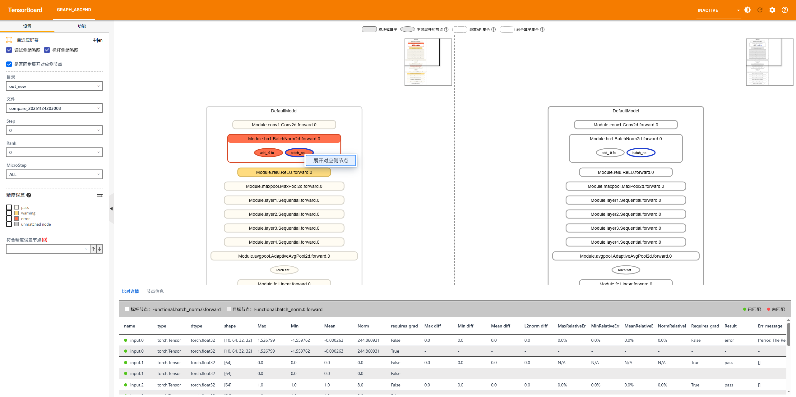

## 使用前准备

**环境准备**

安装msProbe工具，具体请参见《[msProbe工具安装指南](../msprobe_install_guide.md)》。

安装方式选择“编译安装”时，编译命令须配置参数`--include-mod tb_graph_ascend`来构建分级可视化插件。

> **注意事项**: msProbe工具已集成tb_graph_ascend，如果当前环境已安装旧版本tb_graph_ascend，请使用命令`pip uninstall tb_graph_ascend`进行卸载，避免冲突报错。

**数据准备**

采集模型结构数据：选择level为L0（module信息）或者mix（module信息和API信息），即采集结果文件construct.json内容不为空。详细采集方式请参见《[PyTorch场景精度数据采集](../dump/pytorch_data_dump_instruct.md)》。

**约束**

- 仅支持PyTorch框架。
- 支持PyTorch版本：请参考[版本说明](../release_notes.md)。

## 分级可视化功能介绍

### 单图构建

**功能说明**

展示模型结构、精度数据、堆栈信息，并且包含了溢出检测功能。适用于分析模型结构和分析数据溢出的场景。

**注意事项**

依赖采集的模型结构数据，需确保dump配置的level为L0（module信息）或者mix（module信息和API信息），采集结果文件construct.json内容不为空。

**命令格式**

```bash
msprobe graph_visualize -tp <target_path> -o <output_path> [-oc] [-tensor_log] [-progress_log]
```

**参数说明**

| 参数名                                 | 可选/必选 | 说明                                                         |
| -------------------------------------- | --------- | ------------------------------------------------------------ |
| -tp或--target_path                     | 必选      | 指定待调试侧比对路径，str类型。工具根据路径格式自动进行单rank构建、多rank批量构建或多step批量比构建，str 类型。 |
| -o或--output_path                      | 必选      | 配置构图结果文件存盘目录，str类型。文件名称基于时间戳自动生成，格式为：`build_{timestamp}.vis.db`。 |
| -oc或--overflow_check                  | 可选      | 是否开启溢出检测模式，开启后会在输出db文件中（`build_{timestamp}.vis.db`）对每个溢出节点进行标记溢出等级。配置该参数表示开启，默认未配置表示关闭。 |
| -tensor_log或--is_print_compare_log    | 可选      | 配置是否开启单个模块或API的日志打印，仅支持msProbe工具dump的tensor数据。配置该参数表示开启，默认未配置表示关闭。 |
| -progress_log或--is_print_progress_log | 可选      | 配置是否开启任务详细进度的日志打印。配置该参数表示开启，默认未配置表示关闭。 |

**示例1：执行单rank图构建**

```bash
msprobe graph_visualize -tp ./target_path/step0/rank0 -o ./output_path
```

-tp格式需要满足[分级可视化构图所需dump文件落盘格式](#分级可视化构图所需dump文件落盘格式)的单rank格式。

**示例2：执行多rank批量图构建**

```bash
msprobe graph_visualize -tp ./target_path/step0 -o ./output_path
```

-tp格式需要满足[分级可视化构图所需dump文件落盘格式](#分级可视化构图所需dump文件落盘格式)的多rank格式。

**示例3：执行多step批量图构建**

```bash
msprobe graph_visualize -tp ./target_path -o ./output_path
```

-tp格式需要满足[分级可视化构图所需dump文件落盘格式](#分级可视化构图所需dump文件落盘格式)的多step格式。

**示例4：执行单图的溢出检测**

```bash
msprobe graph_visualize -tp ./target_path -o ./output_path -oc
```

在输出结果中会对每个图节点进行溢出检测指标的标记，溢出检测指标如下：

- medium：输入异常，输出正常场景。
- high：输入异常，输出异常；输出norm值相较于输入存在异常增大情况。
- critical：输入正常，输出异常场景。

**输出说明**

在配置的输出路径中，生成一个`.vis.db`后缀的文件，文件名称基于时间戳自动生成，格式为：`build_{timestamp}.vis.db`。

### 双图比对

**功能说明**

展示模型结构、结构差异、精度数据和精度比对指标、精度是否疑似有问题（精度比对指标差异越大颜色越深），且支持跨套件比对、溢出检测和模糊匹配功能。

当前比对支持三种类型的dump数据，分级可视化工具比对时会自动判断：

1. 统计信息（statistics）：仅dump了API和Module的输入输出数据统计信息，占用磁盘空间小。
2. 真实数据（tensor）：不仅dump了API和Module的输入输出数据统计信息，还将tensor进行存盘，占用磁盘空间大，但比对更加准确。
3. md5：dump了API和Module的输入输出数据统计信息和CRC-32信息。

dump类型如何配置见[数据采集配置文件介绍](../dump/config_json_introduct.md)。

**注意事项**

依赖采集的模型结构数据，需确保dump配置的level为L0（module信息）或者mix（module信息和API信息），采集结果文件construct.json内容不为空。

**命令格式**

```bash
msprobe graph_visualize -tp <target_path> -gp <golden_path> -o <output_path> [-lm] [-oc] [-fm] [-tensor_log] [-progress_log]
```

**参数说明**

| 参数名                    | 可选/必选 | 说明                                                                                                                                                                                                                                                                                                                                                                                                                                                                                      |
|------------------------| -------- |-----------------------------------------------------------------------------------------------------------------------------------------------------------------------------------------------------------------------------------------------------------------------------------------------------------------------------------------------------------------------------------------------------------------------------------------------------------------------------------------|
| -tp或--target_path    | 必选     | 指定待调试侧比对路径，str类型。工具根据路径格式自动进行单rank比对、多rank批量比对或多step批量比对。                                                                                                                                                                                                                                                                                                                                                                                                                        |
| -gp或--golden_path    | 可选，但在双图比对场景必选     | 指定标杆侧比对路径，str类型。如果不配置此项则进行单图构建。                                                                                                                                                                                                                                                                                                                                                                                                                                                         |
| -o或--output_path     | 必选     | 配置构图结果文件存盘目录，str类型。文件名称基于时间戳自动生成，格式为：`compare_{timestamp}.vis.db`。                                                                                                                                                                                                                                                                                                                                                                                                                     |
| -lm或--layer_mapping  | 可选     | 跨套件比对，例如同一个模型分别使用了DeepSpeed和Megatron套件的比对场景。配置该参数时表示开启跨套件Layer层的比对功能，指定模型代码中的Layer层后，可以识别对应dump数据中的模块或API。需要指定自定义映射文件*.yaml。自定义映射文件的格式请参见[自定义映射文件（Layer）](#自定义映射文件layer)，如何配置自定义映射文件请参考[模型分级可视化如何配置layer mapping映射文件](../examples/layer_mapping_example.md)。配置该参数后，将仅按节点名称进行比对，忽略节点的type和shape。<br/><br/>模块节点命名格式：**{Module}.{module_name}.{class_name}.{forward/backward}.{调用次数}**。<br/>&#8226; 若module_name不同，则-lm参数需要指定自定义映射文件，例如`-lm mapping.yaml`。<br/>&#8226; 若module_name相同，class_name不同，则直接配置-lm参数即可，例如`-lm`。<br/>&#8226; 若module_name和class_name均相同，则无需配置-lm参数。<br/><br/>可参考的实际案例：[MindSpeed&LLamaFactory数据采集和自动比对](../examples/mindspeed_llamafactory_mapping_example.md)。 |
| -oc或--overflow_check | 可选     | 是否开启溢出检测模式，开启后会在输出db文件中（`compare_{timestamp}.vis.db`）对每个溢出节点进行标记溢出等级。配置该参数表示开启，默认未配置表示关闭。                                                                                                                                                                                                                                                                                                                                                                                               |
| -fm或--fuzzy_match    | 可选     | 是否开启模糊匹配。配置该参数表示开启，默认未配置表示关闭。模糊匹配与默认匹配的区别详见[匹配说明](#匹配说明)。                                                                                                                                                                                                                                                                                                                                                                                                                            |
| -tensor_log或--is_print_compare_log    | 可选                       | 配置是否开启单个模块或API的日志打印，仅支持msProbe工具dump的tensor数据。配置该参数表示开启，默认未配置表示关闭。 |
| -progress_log或--is_print_progress_log | 可选 | 配置是否开启任务详细进度的日志打印。配置该参数表示开启，默认未配置表示关闭。 |

**示例1：执行单rank图比对**

```bash
msprobe graph_visualize -tp ./target_path/step0/rank0 -gp ./golden_path/step0/rank0 -o ./output_path
```

-tp和-gp格式需要满足[分级可视化构图所需dump文件落盘格式](#分级可视化构图所需dump文件落盘格式)的单rank格式。

**示例2：执行多rank批量图比对**

```bash
msprobe graph_visualize -tp ./target_path/step0 -gp ./golden_path/step0 -o ./output_path
```

-tp和-gp格式需要满足[分级可视化构图所需dump文件落盘格式](#分级可视化构图所需dump文件落盘格式)的多rank格式。

**示例3：执行多step批量图比对**

```bash
msprobe graph_visualize -tp ./target_path -gp ./golden_path -o ./output_path
```

-tp和-gp格式需要满足[分级可视化构图所需dump文件落盘格式](#分级可视化构图所需dump文件落盘格式)的多step格式。

**示例4：执行跨套件比对**

调试侧和标杆侧节点名称相同，则仅指定-lm即可。

```bash
msprobe graph_visualize -tp ./target_path -gp ./golden_path -o ./output_path -lm
```

调试侧和标杆侧有节点名称不相同，则需要配置自定义映射文件，-lm参数传入自定义映射文件路径，映射文件如何配置详见参数说明。

```bash
msprobe graph_visualize -tp ./target_path -gp ./golden_path -o ./output_path -lm ./mapping.yaml
```

**示例5：执行溢出检测**

```bash
msprobe graph_visualize -tp ./target_path -gp ./golden_path -o ./output_path -oc
```

在输出结果中会对每个图节点进行溢出检测指标的标记，溢出检测指标如下：

- medium：输入异常，输出正常场景。
- high：输入异常，输出异常；输出norm值相较于输入存在异常增大情况。
- critical：输入正常，输出异常场景。

**示例6：执行模糊匹配**

```bash
msprobe graph_visualize -tp ./target_path -gp ./golden_path -o ./output_path -fm
```

模糊匹配与默认匹配的区别详见[匹配说明](#匹配说明)。

**输出说明**

在配置的输出路径中，生成一个`.vis.db`后缀的文件，文件名称基于时间戳自动生成，格式为：`compare_{timestamp}.vis.db`。

### 仅模型结构比对

**功能说明**

主要关注模型结构而非训练过程数据。例如，在模型迁移过程中，确保迁移前后模型结构的一致性，或在排查精度差异时，判断是否由模型结构差异所引起。

**注意事项**

使用msProbe工具对模型数据进行采集时，**选择仅采集模型结构（task配置为structure）**，此配置将避免采集模型训练过程的数据，从而显著减少采集所需的时间。

dump配置请参考[dump配置介绍](../dump/config_json_introduct.md#task配置为structure)。

**命令格式**

请参考[双图比对](#双图比对)的命令格式。

**参数说明**

请参考[双图比对](#双图比对)的参数说明。

**使用示例**

请参考[双图比对](#双图比对)使用示例中的示例1、示例2和示例3。

**输出说明**

在配置的输出路径中，生成一个`.vis.db`后缀的文件，文件名称基于时间戳自动生成，格式为：`compare_{timestamp}.vis.db`。

### 不同切分策略下的图合并

**功能说明**

不同模型并行切分策略下，两个模型产生了精度差异，需要进行整网数据比对，但被切分的数据或模型结构分布于多rank中无法进行比对，需要将分布在各个rank的数据或模型结构合并后再进行比对。

**注意事项**

- 当前支持的模型并行切分策略：Tensor Parallelism（TP）、Pipeline Parallelism（PP）、Virtual Pipeline Parallelism（VPP），暂不支持Context Parallelism（CP）和Expert Parallelism（EP）。
- 当前支持基于Megatron、MindSpeed-LLM套件的模型进行图合并，其他套件的模型图合并效果有待验证。
- 当前仅支持msProbe工具dump的statistics数据，level需指定L0或者mix。
- 图合并比对时要确保Data Parallelism（DP）切分一致，例如rank=8 tp=1 pp=8的配置，dp=1，图合并将得到一张图，rank=8 tp=1 pp=4的配置，dp=2，图合并将得到两张图，暂不支持数量不一致的图进行比对。

**命令格式**

```bash
msprobe graph_visualize -tp <target_path> [-gp <golden_path>] -o <output_path> [options]
```

**参数说明**

| 参数名                           | 可选/必选 | 说明                                                                                                                                                                                                                                                                                                                                                                                                                                                                                      |
|-------------------------------| ----- |-----------------------------------------------------------------------------------------------------------------------------------------------------------------------------------------------------------------------------------------------------------------------------------------------------------------------------------------------------------------------------------------------------------------------------------------------------------------------------------------|
| -tp或--target_path           | 必选  | 指定待调试侧比对路径，str类型。工具根据路径格式自动进行单rank比对、多rank批量比对或多step批量比对，str类型。 |
| -gp或--golden_path           | 可选  | 指定标杆侧比对路径，str类型。如果不配置此项则进行单图构建。 |
| -o或--output_path            | 必选  | 配置构图结果文件存盘目录，str类型。文件名称基于时间戳自动生成，格式为：`compare_{timestamp}.vis.db`。                                                                                                                                                                                                                                                                                                                                                                                                                     |
| -lm或--layer_mapping  | 可选     | 跨套件比对，例如同一个模型分别使用了DeepSpeed和Megatron套件的比对场景。配置该参数时表示开启跨套件Layer层的比对功能，指定模型代码中的Layer层后，可以识别对应dump数据中的模块或API。需要指定自定义映射文件*.yaml。自定义映射文件的格式请参见[自定义映射文件（Layer）](#自定义映射文件layer)，如何配置自定义映射文件请参考[模型分级可视化如何配置layer mapping映射文件](../examples/layer_mapping_example.md)。配置该参数后，将仅按节点名称进行比对，忽略节点的type和shape。<br/><br/>模块节点命名格式：**{Module}.{module_name}.{class_name}.{forward/backward}.{调用次数}**。<br/>&#738226;若module_name不同，则-lm参数需要指定自定义映射文件，例如`-lm mapping.yaml`。<br/>&#738226;若module_name相同，class_name不同，则直接配置-lm参数即可，例如`-lm`。<br/>&#738226;若cell_name和class_name均相同，则无需配置-lm参数。<br/><br/>可参考的实际案例：[MindSpeed&LLamaFactory数据采集和自动比对](../examples/mindspeed_llamafactory_mapping_example.md)。 |
| -oc或--overflow_check        | 可选  | 是否开启溢出检测模式，开启后会在输出db文件中（`compare_{timestamp}.vis.db`）对每个溢出节点进行标记溢出等级。配置该参数表示开启，默认未配置表示关闭。                                                                                                                                                                                                                                                                                                                                                                     |
| -fm或--fuzzy_match           | 可选  | 是否开启模糊匹配。配置该参数表示开启，默认未配置表示关闭。模糊匹配与默认匹配的区别详见[匹配说明](#匹配说明)。                                                                                                                                                                                                                                                                                                                                                                                                                               |
| -tensor_log或--is_print_compare_log    | 可选                   | 配置是否开启单个模块或API的日志打印，仅支持msProbe工具dump的tensor数据。配置该参数表示开启，默认未配置表示关闭。 |
| -progress_log或--is_print_progress_log | 可选 | 配置是否开启任务详细进度的日志打印。配置该参数表示开启，默认未配置表示关闭。 |
| --rank_size                   | 可选，仅图合并场景必选 | 模型实际训练所用加速卡的数量，int类型。`rank_size=tp*pp*cp*dp`，由于暂不支持CP合并，图合并功能中默认cp=1。                                                                                                                             |
| --tp                          | 可选，仅图合并场景必选 | 张量并行大小，int类型。实际训练脚本中需指定`--tensor-model-parallel-size T`，其中`T`表示张量模型并行大小，即**图合并所需的参数tp**, `tp=T`。                                                                                                  |
| --pp                          | 可选，仅图合并场景必选 | 流水线并行的阶段数，int类型。实际训练脚本中需指定`--pipeline-model-parallel-size P`，其中`P`表示流水线并行的阶段数，即**图合并所需的参数pp**, `pp=P`。                                                                                            |
| --vpp                         | 可选 | 虚拟流水线并行阶段数，int类型。虚拟流水线并行依赖流水线并行，实际训练脚本中需指定`--num-layers-per-virtual-pipeline-stage V`，其中`V`表示每个虚拟流水线阶段的层数；指定`--num-layers L`，其中`L`表示模型总层数，**图合并所需的参数vpp**=`L/V/P`。vpp参数可以不配置，默认vpp=1代表未开启虚拟流水线并行。 |
| --order                       | 可选 | 模型并行维度的排序顺序，str类型。Megatron默认为`tp-cp-ep-dp-pp`。如果使用msProbe工具dump数据指定level为L0并且实际训练脚本中的order非默认值（例如实际训练脚本中指定`--use-tp-pp-dp-mapping`），请传入修改后的order。dump数据指定level为mix则无需修改。                         |

**使用示例**

**示例1：不同tp切分下的图合并比对**

当前示例比对场景为：target_path侧8卡，tp=8，golden_path侧4卡，tp=4。

```bash
msprobe graph_visualize -tp ./target_path -gp ./golden_path -o ./output_path --rank_size 8 4 --tp 8 4 --pp 1 1
```

**示例2：不同pp切分下的图合并比对**

当前示例比对场景为：target_path侧8卡，pp=8，golden_path侧1卡，pp=1。

```bash
msprobe graph_visualize -tp ./target_path -gp ./golden_path -o ./output_path --rank_size 8 1 --tp 1 1 --pp 8 1
```

**示例3：不同vpp切分下的图合并比对**

当前示例比对场景为：target_path侧8卡，pp=8，golden_path侧8卡，pp=8，vpp=2。

```bash
msprobe graph_visualize -tp ./target_path -gp ./golden_path -o ./output_path --rank_size 8 8 --tp 1 1 --pp 8 8 --vpp 1 2
```

**示例4：不同pp和tp切分下的图合并比对**

当前示例比对场景为：target_path侧8卡，pp=8，golden_path侧8卡，tp=8

```bash
msprobe graph_visualize -tp ./target_path -gp ./golden_path -o ./output_path --rank_size 8 8 --tp 1 8 --pp 8 1
```

以上所有示例中，npu_path和bench_path格式必须满足[分级可视化构图所需dump文件落盘格式](#分级可视化构图所需dump文件落盘格式)的多rank格式或多step格式

## 启动TensorBoard

### 可直连的服务器

将生成vis.db文件的路径**out_path**传入--logdir。

```bash
tensorboard --logdir out_path --bind_all
```

启动后会打印日志。


上图中，ubuntu是机器地址，6008是端口号。

**ubuntu需要替换为真实的服务器地址，例如真实的服务器地址为10.123.456.78，则需要在浏览器窗口输入`http://10.123.456.78:6008`**。

### 不可直连的服务器

**如果链接打不开（服务器无法直连需要挂vpn才能连接等场景），可以尝试以下方法，选择其一即可。**

1. 本地电脑网络手动设置代理，例如Windows10系统，在【手动设置代理】中添加服务器地址（例如10.123.456.78）。

   

   然后在服务器中输入如下命令：

   ```bash
   tensorboard --logdir out_path --bind_all
   ```

   最后，在浏览器窗口输入`http://10.123.456.78:6008`。

   **如果当前服务器开启了防火墙，则此方法无效，需要关闭防火墙，或者尝试后续方法。**

2. 或者使用vscode连接服务器，在vscode终端输入：

   ```bash
   tensorboard --logdir out_path
   ```

   

   按住CTRL单击链接即可。

3. 或者将构图结果文件从服务器传输至本地电脑，在本地电脑中查看构图结果。

   PC终端输入：

   ```bash
   tensorboard --logdir out_path
   ```
   
    按住CTRL单击链接即可。

## 浏览器查看

### 浏览器打开图

推荐使用谷歌浏览器，在浏览器中输入机器地址+端口号回车，出现TensorBoard页面，其中/#graph_ascend会自动拼接。


如果您切换了TensorBoard的其他功能，此时想回到模型分级可视化页面，可以单击左上方的**GRAPH_ASCEND**

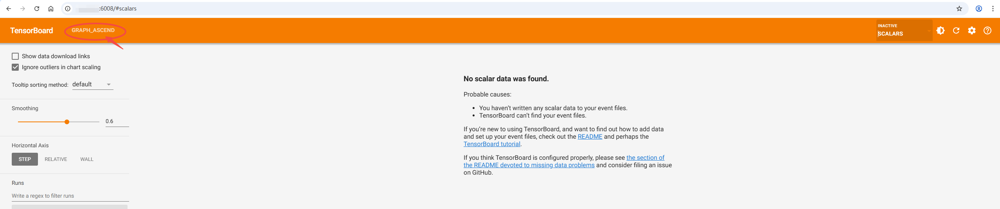

### 查看图

整体界面如下图所示：

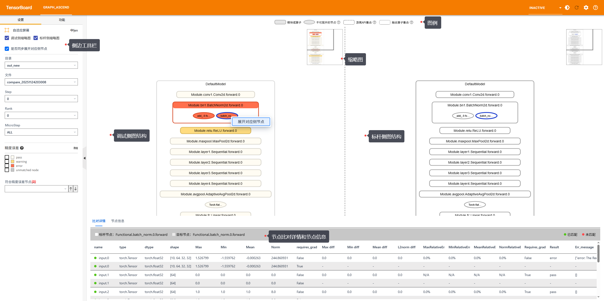

键鼠操作：

- 鼠标左键单击可选中节点，左键双击可控制节点展开或关闭，右键单击可展开菜单栏选择相关功能。
- 鼠标滚轮控制图上下移动。
- 键盘WS控制图放大缩小，AD控制图左右移动。

整体界面**左侧图标**可以单击，使用不同的功能。界面如图所示，对应的基础操作如表所示。

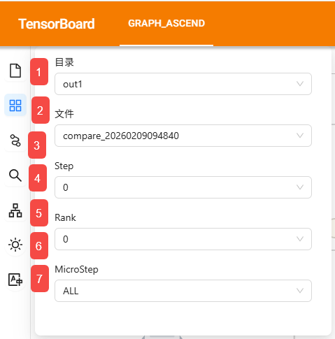

| 编号 | 说明                                                                                                                                                                  |
|----|---------------------------------------------------------------------------------------------------------------------------------------------------------------------|
| 1  | “数据选择”功能。 可切换目录、Step、Rank和MicroStep。其中MicroStep是指在一次完整的权重更新前执行的多次前向和反向传播过程，一次完整的训练迭代（step）可以进一步细分为多个更小的步骤（micro step）。其中分级可视化工具通过识别模型首层结构中一次完整的前向和反向作为一次micro step。 |
| 2  | “精度误差筛选和溢出检测筛选”功能。详见[精度筛选和溢出筛选](#精度筛选和溢出筛选)。                                                                                                                        |
| 3  | “节点匹配”功能。详见[手动选择节点匹配](#手动选择节点匹配)。                                                                                                                                   |
| 4  | “节点搜索”功能。详见[名称搜索](#名称搜索)。                                                                                                                                           |
| 5  | “Dump数据可视化转化”功能。详见[Dump数据可视化转化](#dump数据可视化转化)。                                                                                                                      |
| 6  | “主题切换”功能。可将当前浏览界面切换成“亮色”或“暗色”。                                                                                                                                      |
| 7  | “语言切换”功能。可将当前浏览界面语言切换中文或英文。                                                                                                                                         |

整体界面**右上侧图标**可以单击，使用不同的功能。界面如图所示，对应的基础操作如表所示。

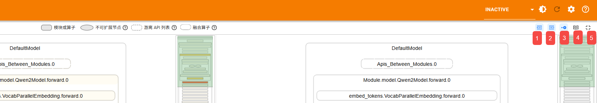

| 编号 | 说明                |
|----|-------------------|
| 1  | 打开/关闭调试侧缩略图，默认打开。 |
| 2  | 打开/关闭标杆侧缩略图，默认打开。 |
| 3  | 是否同步展开对应侧节点，默认是。  |
| 4  | 快捷键说明。            |
| 5  | 自适应屏幕。            |

整体界面**底部表格栏**可以切换“节点信息”，展示节点的“调用堆栈信息”、“数据并行合并详情信息”。其中“数据并行合并详情信息”仅在使用[不同切分策略下的图合并](#不同切分策略下的图合并)功能后展示。


### 名称搜索

界面如图所示，对应的基础操作如表所示。

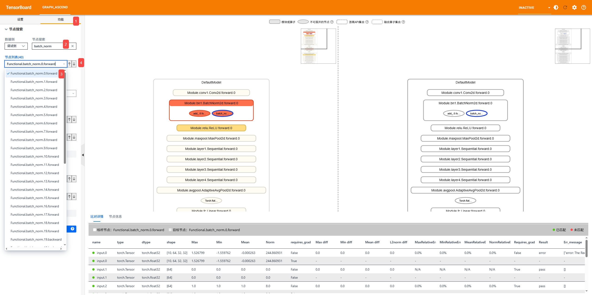

| 编号 | 说明                                    |
|----|---------------------------------------|
| 1  | 侧边工具栏左边图标选择“节点搜索”。                    |
| 2  | 输入待搜索的节点名称自动开始搜索，此搜索功能为模糊搜索且忽略大小写。    |
| 3  | 节点列表中选择节点，图结构将自动展开到相应节点。           |
| 4  | 可选择节点列表中的“上一个”或“下一个”节点，图结构将自动展开到相应节点。 |

### 精度筛选和溢出筛选

界面如图所示，对应的基础操作如表所示。

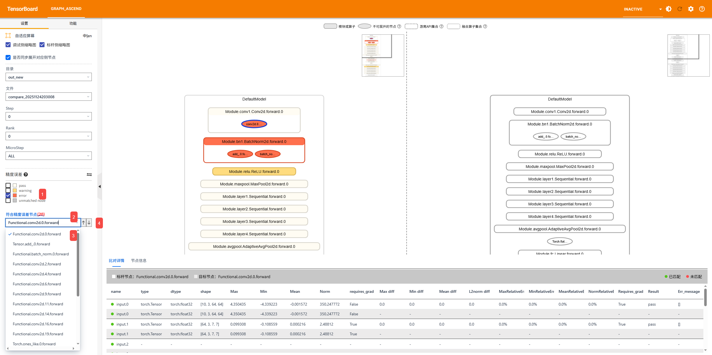

| 编号 | 说明                                                                   |
|----|----------------------------------------------------------------------|
| 1  | 可勾选多选框选择“精度误差”，查看此精度误差下的所有节点。                                        |
| 2  | 选择“精度误差”后自动展开下拉栏节点列表，仅展示叶子节点，展示顺序按数据采集时间升序。鼠标左键单击选择节点，图结构将自动展开到相应节点。 |
| 3  | 输入待搜索的节点名称自动开始搜索，此搜索功能为模糊搜索且忽略大小写。                                   |
| 4  | 可选择节点列表中的“上一个”或“下一个”节点，图结构将自动展开到相应节点。                                |

如果分级可视化构建命令`msprobe graph_visualize`使用了参数`-oc`或`--overflow_check`，则代表开启了溢出检测功能。此时可以在侧边工具栏上方选择“溢出筛选”功能。具体操作同“精度筛选”。


### 未匹配节点筛选

界面如图所示，对应的基础操作如表所示。

参考[匹配说明](#匹配说明)，不符合匹配规则的节点为无匹配节点，颜色标灰。适用于排查两个模型结构差异的场景。

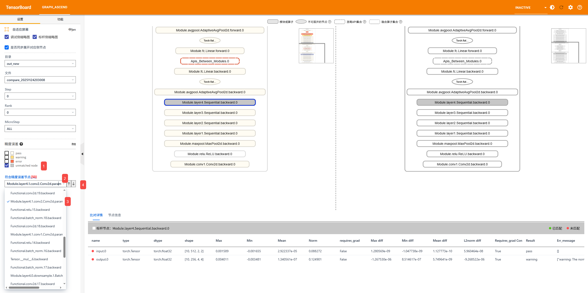

| 编号 | 说明                                                                |
|----|-------------------------------------------------------------------|
| 1  | 可勾选灰色框，查看所有未匹配节点。                                                 |
| 2  | 勾选灰色框后自动展开下拉栏节点列表，仅展示叶子节点，展示顺序按数据采集时间升序。鼠标左键单击选择节点，图结构将自动展开到相应节点。 |
| 3  | 输入待搜索的节点名称自动开始搜索，此搜索功能为模糊搜索且忽略大小写。                                       |
| 4  | 可选择节点列表中的“上一个”或“下一个”节点，图结构将自动展开到相应节点。                             |

### 手动选择节点匹配

可通过浏览器界面，鼠标选择两个待匹配的灰色节点进行匹配。当前暂不支持真实数据模式。

界面如图所示，对应的基础操作如表所示。

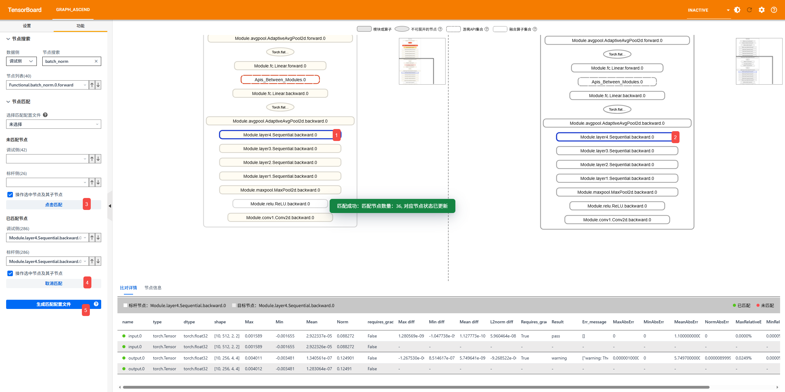

| 编号 | 说明                                                |
|----|---------------------------------------------------|
| 1  | 侧边工具栏左边图标选择“节点匹配”。                                |
| 2  | 鼠标左键单击选择调试侧未匹配节点。                                 |
| 3  | 鼠标左键单击选择标杆侧未匹配节点。                                 |
| 4  | 单击“建立匹配”，自动计算得到精度数据，并进行颜色填充。                      |
| 5  | 单击“取消匹配”，可选择取消已匹配节点的匹配，取消后节点颜色标灰。                 |
| 6  | 匹配完成后可单击“生成匹配配置文件”，生成匹配配置文件，可将鼠标指针放置于问号图标处查看具体说明。 |

### Dump数据可视化转化

可通过浏览器界面，实现msProbe工具的dump数据的可视化转化，无需再使用`msprobe graph_visualize`命令。

使用此功能时请确认传入数据的权限，文件夹应当为750（rwx r-x ---），文件应当为640（rw- r-- ---），避免出现加载失败的问题。

界面如图所示，对应的基础操作如表所示。

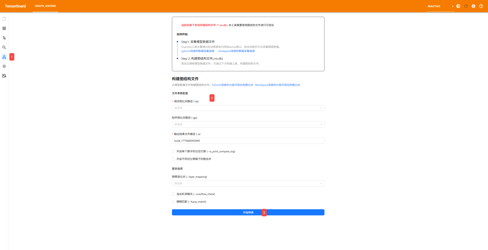

| 编号 | 说明                                                                                                                                                                                                         |
|----|------------------------------------------------------------------------------------------------------------------------------------------------------------------------------------------------------------|
| 1  | 侧边工具栏左边图标选择“Dump数据可视化转化”。                                                                                                                                                                                  |
| 2  | 构建图结构文件，进行文件参数配置。参数说明详见[不同切分策略下的图合并-参数说明](#不同切分策略下的图合并)。**其中，待转换的dump数据路径必须是`--logdir`的子路径（--logdir说明详见[启动TensorBoard](#启动tensorboard)），否则在界面中配置“调试侧比对路径 (-tp)”或“标杆侧比对路径 (-gp)”时，无法在下拉栏中选择到待转换的dump数据路径。** |
| 3  | 单击“开始转换”。                                                                                                                                                                                                      |

开始转换界面如下：

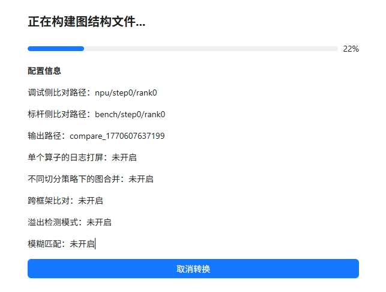

转换完成，可选择“加载该文件”按钮，查看本次转换完成的图结构；也可选择“返回”按钮，返回“Dump数据可视化转化”界面，再次进行转换。


如果转换失败，页面将展示异常日志，可以尝试基于异常日志排查问题。如果无法解决问题，请在当前代码仓库“Issues”页面提交Issue求助。

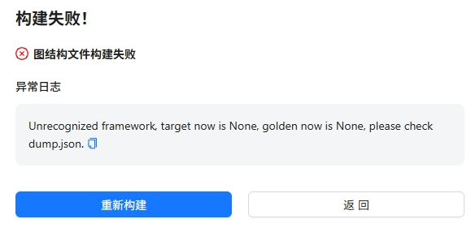

## 图比对说明

### 颜色说明

颜色分为以下四类：

- 红色：error
- 橙色：warning
- 白色/米白色：pass
- 灰色：节点未匹配

一个节点代表一个API或模块，一般会包含多个输入参数和输出，节点颜色基于输入参数和输出由多个指标算法共同计算得到，最终颜色标注优先级error > warning > pass。

error标记情况：

1. 一个API或模块的NPU的最大值或最小值中存在nan/inf/-inf，如果Bench指标存在相同现象则忽略（真实数据模式、统计数据模式）。
2. 一个API或模块的One Thousandth Err Ratio的input/parameters > 0.9同时output < 0.6（真实数据模式）（仅标记output）（使用输入进行计算）。
3. 一个API或模块的input的norm值相对误差< 0.1且output的norm值相对误差> 0.5（统计数据模式）（仅标记output）（使用输入进行计算）。
4. 一个API或模块的Requires_grad（计算梯度）不一致（真实数据模式、统计数据模式）。
5. 一个API或模块的非tensor标量参数不一致（真实数据模式、统计数据模式）。
6. 一个API或模块的CRC-32值不一致（md5模式）。
7. 一个API或模块的dtype不一致（真实数据模式、统计数据模式）。
8. 一个API或模块的shape不一致（真实数据模式、统计数据模式）

warning标记情况：

1. 一个API或模块的output的norm值相对误差是input/parameters的norm值相对误差的10倍（统计数据模式）（仅标记output）（使用输入进行计算）。
2. 一个API或模块的Cosine的input/parameters > 0.9且input/parameters - output > 0.1（真实数据模式）（仅标记output）（使用输入进行计算）。
3. 一个API或模块的参数未匹配（md5模式）。

灰色情况：

参考[匹配说明](#匹配说明)，未达到匹配条件，两个节点无法匹配比对。

特殊场景：

1. 输入存在占位的API，涉及到使用输入进行计算的指标规则不适用，包括：['_reduce_scatter_base', '_all_gather_base', 'all_to_all_single', 'batch_isend_irecv']
2. 冗余API，所有指标不适用，包括：['empty', 'empty_like', 'numpy', 'to', 'setitem', 'empty_with_format', 'new_empty_strided', 'new_empty', 'empty_strided']

### 指标说明

精度比对从三个层面评估API的精度，依次是：真实数据模式、统计数据模式和MD5模式。比对结果分别有不同的指标。

**公共指标**

- name：参数名称，例如input.0
- type：类型，例如torch.Tensor
- dtype：数据类型，例如torch.float32
- shape：张量形状，例如[32, 1, 32]
- Max：最大值
- Min：最小值
- Mean：平均值
- Norm：L2-范数

**真实数据模式指标**

- Cosine：tensor余弦相似度
- EucDist：tensor欧式距离
- MaxAbsErr：tensor最大绝对误差
- MaxRelativeErr：tensor最大相对误差
- One Thousandth Err Ratio：tensor相对误差小于千分之一的比例（双千分之一）
- Five Thousandth Err Ratio：tensor相对误差小于千分之五的比例（双千分之五）

**统计数据模式指标**

- (Max, Min, Mean, Norm) diff：统计量绝对误差
- (Max, Min, Mean, Norm) RelativeErr：统计量相对误差

**MD5模式指标**

- md5：CRC-32值

## 附录

### 自定义映射文件（Layer）

文件名格式：\*.yaml，*为文件名，可自定义。

文件内容示例：

```yaml
PanGuVLMModel:                                    # Layer层名称
  vision_model: language_model.vision_encoder     # 模型代码中嵌套的Layer层名称
  vision_projection: language_model.projection

RadioViTModel:
  input_conditioner: radio_model.input_conditioner
  patch_generator: radio_model.patch_generator
  radio_model: radio_model.transformer

ParallelTransformerLayer:
  input_norm: input_layernorm
  post_attention_norm: post_attention_layernorm

GPTModel:
  decoder: encoder

SelfAttention:
  linear_qkv: query_key_value
  core_attention: core_attention_flash
  linear_proj: dense

MLP:
  linear_fc1: dense_h_to_4h
  linear_fc2: dense_4h_to_h
```

Layer层名称需要从模型代码中获取。

yaml文件中只需配置待调试侧与标杆侧模型代码中功能一致但名称不同的Layer层，名称相同的Layer层会被自动识别并映射。

模型代码示例：

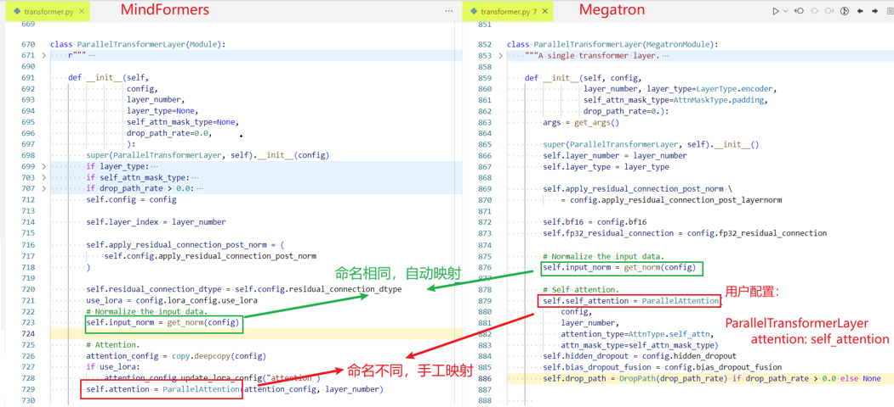

### 分级可视化构图所需dump文件落盘格式

**单rank格式**

路径格式示例：dump_path/step0/rank0

路径下必须包含dump.json、stack.json和construct.json，且construct.json不能为空。如果construct.json为空，请检查dump的level参数是否没有选择L0或者mix。

**多rank格式**

路径格式示例：dump_path/step0

路径下必须包含rank+数字格式的文件夹，且每个rank文件夹中必须包含dump.json、stack.json和construct.json，且construct.json不能为空。如果construct.json为空，请检查dump的level参数是否没有选择L0或者mix。

**多step格式**

路径格式示例：dump_path

路径下必须包含step{数字}格式的文件夹，且每个step文件夹中必须包含rank{数字}格式的文件夹，每个rank文件夹中必须包含dump.json、stack.json和construct.json，且construct.json不能为空。如果construct.json为空，请检查dump的level参数是否没有选择L0或者mix。

```ColdFusion
├── dump_path
│   ├── step0
│   |   ├── rank0
│   |   │   ├── dump_tensor_data（仅配置dump的task参数选择tensor时存在）
|   |   |   |    ├── Tensor.permute.1.forward.pt
|   |   |   |    ├── MyModule.0.forward.input.pt  
|   |   |   |    ...
|   |   |   |    └── Function.linear.5.backward.output.pt
│   |   |   ├── dump.json             # 数据信息
│   |   |   ├── stack.json            # 调用栈信息
│   |   |   └── construct.json        # 分层分级结构，level为L1时，construct.json内容为空
│   |   ├── rank1
|   |   |   ├── dump_tensor_data
|   |   |   |   └── ...
│   |   |   ├── dump.json
│   |   |   ├── stack.json
|   |   |   └── construct.json
│   |   ├── ...
│   |   |
|   |   └── rankn
│   ├── step1
│   |   ├── ...
│   ├── step2
```

### 匹配说明

1.默认匹配

- 所有节点dump名称一致。
- 节点的层级一致（父节点们一致）。

2.模糊匹配

- Module节点dump名称一致，两个匹配上的Module节点，忽略各自节点下所有api的dump调用次数，按照**名称一致且保持Module节点内的调用顺序一致的前提下**进行匹配。

  

**dump名称 = 名称 + 调用次数**，例如Torch.matmul.2.forward，matmul是名称，2是调用次数。

## FAQ

Q：图比对场景，节点呈现灰色，且没有精度比对数据，怎么处理？

A：节点呈现灰色，代表左边待调试侧节点与右边标杆侧节点没有匹配上，可能有以下几点原因：

- **标杆侧确实没有能够与待调试侧匹配上的节点**，属于代码实现上的差异，请确认此差异是否正常，是否会影响到整网精度。
- **节点名称一致但调用次数不一致（例如Tensor.permute.1.forward和Tensor.permute.3.forward），或者节点的所在层级的父层级不一致**，导致节点无法匹配。
  - 具体匹配规则见[匹配说明](#匹配说明)，可尝试使用模糊匹配功能，如何使用此功能请参考[双图比对-参数说明](#双图比对)。
- **节点名称不一致（例如Tensor.permute.1.forward和Tensor.my_permute.1.forward）**，导致节点无法匹配，目前提供两种方法，任选其一即可。
  - 可使用layer mapping功能，如何使用此功能请参考[双图比对-参数说明](#双图比对)，如何自定义映射文件请参考[模型分级可视化如何配置layer mapping映射文件](../examples/layer_mapping_example.md)。
  - 可通过浏览器页面手动选择未匹配节点进行匹配，请参考[手动选择节点匹配](#手动选择节点匹配)。
