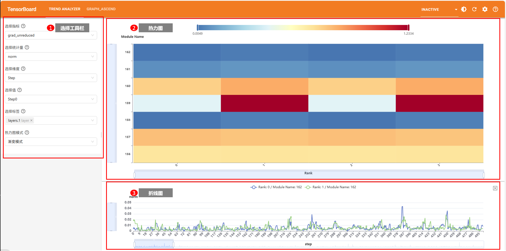
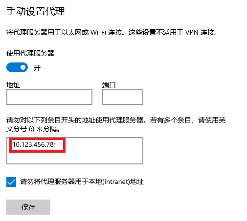
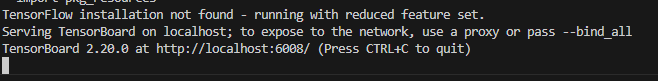
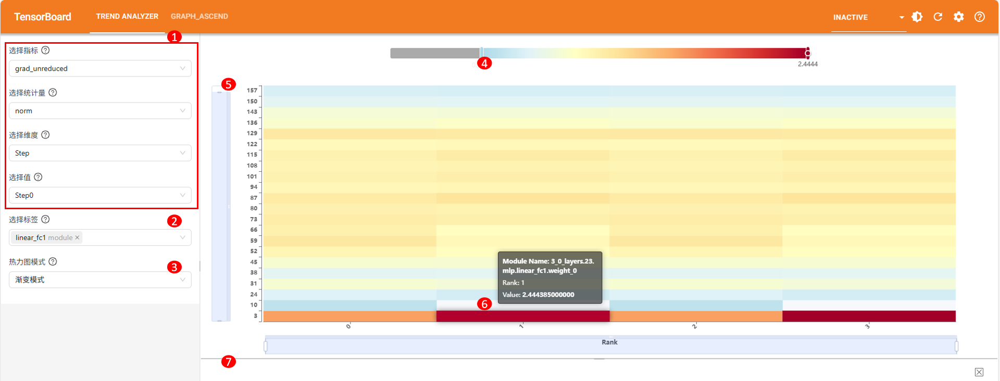

# 趋势可视化

## 简介

趋势可视化功能将msProbe工具采集的精度数据进行解析，识别其中模型层的张量目标，以及其在迭代步数、节点rank和网络模型中的位置。将张量目标的统计量数据从迭代步数step、节点rank和张量目标三个维度进行趋势可视化，方便用户从数据整体的趋势分布观测精度数据，分析精度问题。

**基本概念**

- msProbe：全称MindStudio Probe，是精度调试工具包，可以定位模型训练或推理中的精度问题。
- dump：MindStudio Probe下数据采集功能，采集的数据称为dump数据。
- monitor：MindStudio Probe下训练状态监测功能，采集的数据称为monitor数据。
- 三个维度：趋势可视化工具中，可选的观测数据的维度，特指以下三个：迭代步数（Step）、节点（Rank）和张量目标（Module Name，主要以所属网络层或算子名进行区分）。

**使用流程**

1. 进行工具安装以及数据的采集，详见[使用前准备](#使用前准备)。
2. 使用命令行工具解析精度数据，生成db格式的SQLite数据库文件，详见[精度数据解析](#精度数据解析)。
3. 启动TensorBoard服务，将`--logdir`参数设置为精度数据解析功能的输出路径。
4. 用浏览器打开TensorBoard服务页面，在`TREND ANALYZER`插件窗口下查看数据。

## 使用前准备

**环境准备**

安装msProbe工具，详情请参见《[msProbe工具安装指南](../msprobe_install_guide.md)》。

安装方式选择“编译安装”时，编译命令须配置参数`--include-mod=trend_analyzer`来构建趋势可视化插件。

**数据准备**

- dump数据场景（采集模型数据，选择`level`为`L0`或者`mix`）
  - PyTorch框架详细采集方式请参见《[PyTorch场景精度数据采集](../dump/pytorch_data_dump_instruct.md)》。
  - MindSpore框架详细采集方式请参见《[MindSpore场景精度数据采集](../dump/mindspore_data_dump_instruct.md)》。
- monitor数据场景（输出格式`format`指定为`csv`）
  - 详细采集方式请参见《[Monitor训练状态轻量化监测工具](../monitor_instruct.md)》。
  
**约束**

- 支持PyTorch框架和MindSpore框架。

## 精度数据解析

**功能说明**

解析dump数据或monitor数据，识别其中各模型层下的张量目标，根据dump数据落盘顺序确定张量目标在迭代步数、节点rank和网络模型中的位置，并将解析结果转存为db格式的SQLite数据库文件。

**注意事项**

- dump数据: 仅支持dump配置的`level`为`L0`或者`mix`级别采集的数据。
- monitor数据: 仅支持输出格式`format`指定为`csv`采集的数据。
- 为了有效呈现数据趋势，落盘数据范围为`[-1e9, 1e9]`，超出此范围的数据将被截断，`inf`值将被转换为`1e9+1`，`-inf`值将被转换为`-1e9-1`。
- 解析过后的文件可能存在多个，[启动TensorBoard](#启动tensorboard)时默认会打开传入目录下面的第一个.trend.db文件，暂不支持文件选择。

**命令格式**

```shell
msprobe data2db --db <db_path> --data <data_path> [--format <format>] [--mapping <mapping_json>] [--micro_step <use_micro_step>] [--process_num <process_num>]
```

**参数说明**

| 参数             | 可选/必选 | 说明                                                         |
| ---------------- | --------- | ------------------------------------------------------------ |
| --db             | 必选      | 解析结果文件存盘目录，str类型。在该目录下生成后缀为`.trend.db`的SQLite文件。 |
| --data           | 必选      | 输入数据路径，str类型。支持dump数据目录或monitor数据目录。dump数据需配置到step文件夹的上一层目录，monitor数据配置到rank文件夹的上一层目录。   |
| --format         | 可选      | 数据格式，str类型。可选值：`auto`（自动检测）、`dump`、`monitor`，默认为`auto`。 |
| --mapping        | 可选      | 指定json映射文件路径（须配置到json文件名，例如./mapping.json），str类型。程序会在解析精度数据时，将其中模型层的名称或算子名称根据映射文件做转换，以达到精简名称或step间模型或算子名称对齐的效果。映射文件详细配置请参见[mapping配置文件说明](#mapping配置文件说明)。 |
| --micro_step     | 可选      | 是否启用微步计数，bool类型。默认值为`true`，启用微步计数可将一个迭代（step）拆分为多个微迭代进行分析。 |
| --process_num    | 可选      | 并行处理进程数，int类型。默认值为1，仅用于monitor数据的并行处理加速，dump数据处理暂不支持多进程。 |

**使用示例**

解析`/data/dump_path`下的数据文件， 自动识别monitor数据和dump数据，将解析所得db格式的SQLite数据库文件放在`/data/db_path`路径下。单进程执行，以微迭代计数，且不使用mapping。

```shell
msprobe data2db --data /data/dump_path --db /data/db_path
```

**输出说明**

dump数据解析命令执行成功后，在`/data/db_path`下生成`dump_data.trend.db`文件。

monitor数据解析命令执行成功后，在`/data/db_path`下生成`monitor_data.trend.db`文件。

## 趋势分析

### 功能说明

趋势分析是将张量目标的统计量数据从迭代步数step、节点rank和张量目标三个维度进行可视化分析，方便用户从数据整体的趋势分布观测精度数据，分析精度问题。

### 界面介绍

趋势可视化构图界面如图所示，包含区域一（选择工具栏）、区域二（热力图）和区域三（折线图）。


- 区域一：选择工具栏，依次提供指标、统计量、显示维度、维度值的选择，并提供标签筛选和热力图模式设置。
- 区域二：热力图，展示当前选择维度的值下，精度数据在其余两个维度上的分布热力图。
- 区域三：折线图，当前选择维度的值下，点击热力图中的某个点，折线图展示该点对应的精度数据随维度值变化趋势。

### 使用说明

#### 启动TensorBoard

**可直连的服务器**

将生成.trend.db文件的路径`out_path`传入--logdir。

```bash
tensorboard --logdir out_path --bind_all
```

启动后会打印日志。


上图中，ubuntu是机器地址，6008是端口号，可以通过--port参数指定其他端口号。

> [!note]
>
> ubuntu需要替换为真实的服务器地址，例如真实的服务器地址为10.123.456.78，则需要在浏览器窗口输入 [http://10.123.456.78:6008](http://10.123.456.78:6008/)。

**不可直连的服务器**

如果链接打不开（服务器无法直连需要挂vpn才能连接等场景），可以尝试以下方法，选择其一即可。

1. 本地电脑网络手动设置代理，例如Windows10系统，在【手动设置代理】中添加服务器地址（例如10.123.456.78）。

   

   然后在服务器中输入如下命令：

   ```bash
   tensorboard --logdir out_path --bind_all
   ```

   最后，在浏览器窗口输入<http://10.123.456.78:6008。>

   > [!note]
   >
   > 如果当前服务器开启了防火墙，则此方法无效，需要关闭防火墙，或者尝试后续方法。

2. 或者使用vscode连接服务器，在vscode终端输入：

   ```bash
   tensorboard --logdir out_path
   ```

   

   按住CTRL点击链接即可。

3. 或者将构图结果件从服务器传输至本地电脑，在本地电脑中安装msProbe查看构图结果。

   PC终端输入：

   ```bash
   tensorboard --logdir out_path
   ```

   按住CTRL点击链接即可。

#### 打开浏览器界面

推荐使用谷歌浏览器，按下图操作进入趋势可视化构图页面：


1. 在浏览器中输入机器地址+端口号回车，出现TensorBoard页面。
2. 点击左上方的`TREND ANALYZER`，进入趋势可视化构图页面。

#### 展示热力图

通过选择工具栏中的指标、统计量、显示维度和维度值，即可展示当前维度值下，精度数据在其余两个维度上的分布热力图。界面如图所示，具体操作如下表所示。


| 编号 | 说明 |
|--|--|
|1|选择需要展示数据基本范围，依次选择指标、统计量、维度和维度值，具体见[选择参数范围](#选择参数范围) 。选择完毕即会加载对应热力图。|
|2|可选，点击选择标签，在下拉框中选择或输入需要筛选的标签值，通过标签筛选仅显示相关Module Name的数据。可多选，标签类型见[选择参数范围](#选择参数范围)。|
|3|可选，点击热力图模式下拉框，切换为渐变模式或分段模式。<br/>&#8226; 渐变模式：精度数据按渐变颜色展示，颜色由蓝色渐变到红色，数值越小，颜色越蓝。<br/>&#8226; 分段模式：精度数据按不同颜色分段展示。|
|4|可选，拖动热力条，调整热力图展示的数值范围。|
|5|可选，拖动热力图X轴或Y轴上滑块，调整热力图展示的坐标轴范围。|
|6|可选，悬浮在热力图上，展示当前鼠标位置数据块的具体信息。|
|7|可选，拖动热力图与折线图分割线，调整热力图占页面比例。|

当选择维度为Step时，如果是Megatron模型并行场景，可以使用[Megatron模型并行可视化](#megatron模型并行可视化)对照理解各个rank下采集的网络层数据与实际整网位置对应关系。

**选择参数范围**<a id="选择参数范围"></a>

|选择范围|说明|
|--|--|
|指标|dump数据场景：<br/>&#8226; forward：前向过程数据，张量属于dump.json中以"forward.X"为后缀的网络层（X为编号）或".forward"为后缀的算子API。<br/>&#8226; backward：反向过程数据，张量属于dump.json中以"backward.X"为后缀的网络层（X为编号）或".backward"为后缀的算子API。<br/>&#8226; recompute：重计算过程数据，张量属于dump.json中"is_recompute"属性为True的网络层或算子API。<br/>&#8226; parameters_grad：参数梯度数据，张量属于dump.json中以"parameters_grad"为后缀的网络层数据。<br> monitor数据场景：<br/>&#8226; 根据monitor数据文件前缀自动提取，支持项包括["actv", "actv_grad", "exp_avg", "exp_avg_sq", "grad_unreduced", "grad_reduced", "param_origin", "param_updated"]。|
|统计量|&#8226; dump数据场景: 固定为 "norm"、"max"、"mean"、"min"，分别表示2范数、最大值、均值、最小值。<br/>&#8226; monitor数据场景：根据csv文件内容自动提取，当列包含有效数据时，自动提取该列列名作为统计量选项。|
|维度|包含以下可选项：<br/>&#8226; Step：通过热力图查看单个step下所有数据（X轴为Rank，Y轴为Module Name），点选查看单个张量目标在Step维度下的趋势折线图。<br/>&#8226;  Rank：通过热力图查看单个rank下所有数据（X轴为Step，Y轴为Module Name），点选查看单个张量目标在Rank维度下的趋势折线图。<br/>&#8226; Module Name：通过热力图查看单个张量目标的所有数据（X轴为Step，Y轴为Rank），点选查看单个张量目标在Module Name维度下的趋势折线图。|
|标签|包含以下可选类型：<br/>&#8226; default类标签：标志张量目标属于网络层数据，如"Module", "Cell"。<br/>&#8226; layer类标签：从网络层名中提取的形如xxx.N的标签，其中xxx为字符串，N为整数，代表网络层编号，如"layers.0"。<br/>&#8226; index类标签：张量所属输入输出位置，例如输入中第0个张量标记为"input.0"。<br/>&#8226;  module类标签：从网络层名中提取的字符串标签，代表网络层类型，如"TransformerLayer"。<br/>&#8226;  function类标签：未提取出layer类标签的算子API名。|

#### 展示折线图

通过点击热力图中的某个点，即可展示该点对应的精度数据随维度值变化趋势。界面如图所示，具体操作如下表所示。


| 编号 | 说明 |
|--|--|
|1|按[展示热力图](#展示热力图)选择需要展示数据基本范围，等待热力图加载完毕。|
|2|点击热力图中的某个点，展示该点对应的精度数据随维度值变化趋势。可多选，同时加载多条折线，方便比对。|
|3|可选，拖动折线图分割线，调整折线图占页面比例。|
|4|可选，点击折线图图例，可切换显示或隐藏对应折线。|
|5|可选，悬浮在折线图上，展示当前鼠标位置所有折线的具体数据信息。|
|6|可选，拖动折线图X轴或Y轴上滑块，调整折线图展示的坐标轴范围。|
|7|可选，拖动折线图，或滑动鼠标滚轮，调整折线图展示的X轴范围。|
|8|可选，点击清空按钮，清空当前展示的折线图。|

## Megatron模型并行可视化

**功能说明**

Megatron模型并行可视化是为[展示热力图](#展示热力图)功能提供Megatron模型并行场景各卡网络层与整网位置对应关系可视化能力。

Megatron框架中的模型并行会将模型切分在不同节点rank上。分析精度数据时，各个节点下采集的模型层数据可能仅包含整体模型的部分层，无法直观看出这些层处于整体模型中的位置。Megatron模型并行可视化功能提供多节点模型并行切分的可视化能力，帮助用户快速识别当前模型并行配置下，模型层在各个设备上的分布情况。

**注意事项**

仅支持Megatron场景下，张量并行、流水线并行、虚拟流水线并行和数据并行模式。
仅支持节点rank数小于等于1024且模型层小于等于256层场景，即需`world_size ≤ 1024` 且 `num_layers ≤ 256`。

**使用示例**

1. 创建Python脚本，以创建的命名为`plot_model.py`的脚本为例，将以下代码拷贝到`plot_model.py`脚本中，并按实际情况修改`ParallelConfig`中配置。

    ```python
    from msprobe.core.common.megatron_utils import ParallelConfig, plot_model_parallelism
    
    config = ParallelConfig(
        world_size=32,
        num_layers=48,
        tensor_parallel_size=4,
        pipeline_parallel_size=4,
        num_layers_per_virtual_pipeline_stage=3,
        order="tp-cp-ep-dp-pp",
        standalone_embedding_stage=False,
        output_path='./'
    )
    plot_model_parallelism(config)
    ```

    参数详细介绍请参见[plot_model_parallelism](#plot_model_parallelism)接口。
    
2. 执行如下命令开启转换。

    ```shell
    python plot_model.py
    ```

**输出说明**

`plot_model_parallelism`接口调用成功后，在配置的输出路径`output_path`中，生成一个`png`文件, 格式为`ws{world_size}_ln{num_layers}_tp{tensor_parallel_size}_pp{pipeline_parallel_size}_vpp{virtual_pipeline_parallel_size}.png`。其中`virtual_pipeline_parallel_size`为根据`num_layers_per_virtual_pipeline_stage`等传入参数计算出来的虚拟流水线并行分组大小。

浏览png文件，如下图所示：


图片内容介绍：

| 字段         | 说明 | 
| -------------- | --------- |
| Model Parallelism Configuration | 用户设置或计算得来的并行配置信息，包括：<br> Total Layers：模型的总层数，即脚本中的`num_layers`； <br> DP：数据并行分组大小，通过传入并行参数计算得来；<br> TP：张量并行分组大小，即脚本中的`tensor_parallel_size`； <br> PP：流水线并行分组大小，即脚本中的`pipeline_parallel_size`；<br> VPP：虚拟流水线并行分组大小，即文件名中`virtual_pipeline_parallel_size`，通过传入并行参数计算得来。    |                 
| TP Group | 纵坐标，张量并行分组，形如`Group{num}: Rank{start}-{end}`，其中`num`为分组编号，`start`和`end`分别表示分组内第一个rank的编号和最后一个rank的编号。例如，`Group0: Rank0-3`表示第0个分组，其中包含rank0到rank3共4个rank。     |                 
| Virtual Pipeline Stage | 横坐标，流水线并行阶段或虚拟流水线并行阶段，形如`Stage {num}`，其中`num`表示阶段编号。      |                 
| Model Copies | 模型副本图例。数据并行中，以不同颜色标记输入数据不同的模型副本。      |                 
| `Embed`/ `L{start}-{end}`/ `Out`  | 图中颜色矩阵上的文字，标识一个张量并行分组下的一个阶段包含哪些模型层，其中：<br>  `Embed`：表示当前阶段为模型第一个阶段，通常包含嵌入层；<br> `L{start}-{end}`：表示当前阶段包含模型从start至end的模型层，例如`L1-3`说明当前阶段包含整个模型的第1、第2和第3模型层；<br> `Out`: 表示当前阶段为模型最后一个阶段，通常包含输出层。<br> 如果同时满足多个阶段定义，以"+"连接。    |                 

## 附录

### mapping配置文件说明

mapping配置文件是为[精度数据解析](#精度数据解析)功能的--mapping参数提供数据输入。
配置--mapping参数后，数据解析在处理每个精度数据文件中的模型层的名称或算子名称时，会依次按mapping.json中配置的键、值进行替换。该功能适用于需要精简名称或step间目标名称不一致需对齐的场景。

json文件格式和示例如下，键值均为字符串。

```json
{
  ".TE": ".",
  ".MindSeed": "."
}
```

以上格式中，左侧字段为“键”（如".TE"），右侧字段为“值”（如"."），以上配置代表将名称".TE"替换为"."，将名称".MindSeed"替换为"."。

### 公开接口

#### plot_model_parallelism

**函数原型**

```python
plot_model_parallelism(config: ParallelConfig) -> None
```

**参数说明**

配置参数实例（ParallelConfig类实例），在实例初始化时传入参数。

| 参数名                                | 输入/输出 | 说明                                                                                                                                                                    |
| ------------------------------------- | --------- | ----------------------------------------------------------------------------------------------------------------------------------------------------------------------- |
| world_size                            | 输入      | 必选参数，模型部署的总rank数，int类型，支持范围为[1, 1024]。                                                                                                                                 |
| num_layers                            | 输入      | 必选参数，模型的总层数，int类型，支持范围为[1, 256]。                                                                                                                                       |
| tensor_parallel_size                  | 输入      | 可选参数，张量并行分组大小，int类型，默认值为1。实际训练脚本中指定`--tensor-model-parallel-size T`，其中`T`为指定的张量并行分组大小。                                                                                                                            |
| pipeline_parallel_size                | 输入      | 可选参数，流水线并行分组大小，int类型，默认值为1。实际训练脚本中指定`--pipeline-model-parallel-size P`，其中`P`为指定的流水线并行分组大小。                                                                                                                          |
| num_layers_per_virtual_pipeline_stage | 输入      | 可选参数，每个虚拟流水线阶段包含的层数，int类型，默认值为None，表示未开启虚拟流水线并行。实际训练脚本中指定`--num-layers-per-virtual-pipeline-stage V`，其中`V`为指定的每个虚拟流水线阶段的层数。 |
| order                                 | 输入      | 可选参数，模型并行维度的排序顺序，str类型。默认为Megatron默认设置，即`tp-cp-ep-dp-pp`。                                                                                                             |
| standalone_embedding_stage            | 输入      | 可选参数，是否开启将嵌入层作为独立的流水线阶段的配置，bool类型，配置True表示开启，False表示关闭，默认值为False。                                                                                                   |
| output_path                           | 输入      | 可选参数，可视化结果输出路径，str类型，默认值为'./'。                                                                                                                   |

**返回值说明**

无

# FAQ

1. 如何使用趋势可视化工具对比两组不同实验的精度数据文件？
   
   答：趋势可视化工具并不区分标杆实验和对比实验，仅根据输入的精度数据文件路径进行对比。如需对比两组不同实验的精度数据文件，用户需手动将两组文件子目录移至同一目录，然后使用趋势可视化工具查看和对比。

   例如：存在如下两组dump数据文件，dump_path1和dump_path2:

   ```shell
   ├── dump_path1
   │   ├── step0
   │   |   ├── rank0
   │   |   |   ├── dump.json
   │   |   |   ├── stack.json
   |   |   |   └── construct.json
   │   |   |── rank1
   │   ├── step1
   ├── dump_path2
   │   ├── step0
   │   |   ├── rank0
   │   |   |── rank1
   │   ├── step1
   ```

   您可以按追加step的方式将dump_path1和dump_path2子目录移至同一目录：

   ```shell
   ├── dump_path_compare
   │   ├── step0 # 原dump_path1的step0
   │   ├── step1 # 原dump_path1的step1
   │   ├── step2 # 原dump_path2的step0
   │   ├── step3 # 原dump_path2的step1
   ```

   执行命令，获得共4个step的精度数据数据库，此时对比step0和step2的精度数据趋势等同于对比原dump_path1和dump_path2的step0的精度数据趋势：

   ```shell
   msprobe data2db --data dump_path_compare --db ./output --format dump
   ```

   您也可以按追加rank的方式将dump_path1和dump_path2子目录移至同一目录：

   ```shell
   ├── dump_path_compare
   │   ├── step0
   │   |   ├── rank0  # 原dump_path1的step0/rank0
   │   |   ├── rank1  # 原dump_path1的step0/rank1
   │   |   ├── rank2  # 原dump_path2的step0/rank0
   │   |   ├── rank3  # 原dump_path2的step0/rank1
   │   ├── step1
   │   |   ├── rank0 # 原dump_path1的step1/rank0
   │   |   ├── rank1 # 原dump_path1的step1/rank1
   │   |   ├── rank2 # 原dump_path2的step1/rank0
   │   |   ├── rank3 # 原dump_path2的step1/rank1
   ```

   执行命令，获得共4个rank的精度数据可视化结果，此时对比step0的rank0和rank2的精度数据趋势等同于对比原dump_path1和dump_path2的step0的rank0的精度数据趋势。
