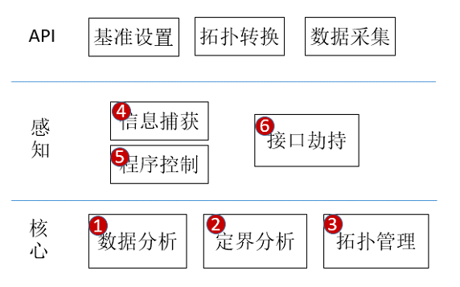

# MindStudio26.0.0精度调试特性分析与设计说明书

<table>
    <tr>
        <td>所属SIG组:</td>
        <td>mstt-sig</td>
    </tr>
    <tr>
        <td>落入版本:</td>
        <td>MindStudio26.0.0</td>
    </tr>
    <tr>
        <td>设计人员:</td>
        <td>wangchao</td>
    </tr>
    <tr>
        <td>日期:</td>
        <td>2026.1.20</td>
    </tr>
</table>

**Copyright © 2026 MindStudio Community**

您对&quot;本文档&quot;的复制，使用，修改及分发受知识共享(Creative Commons)署名—相同方式共享4.0国际公共许可协议(以下简称&quot;CC BY-SA 4.0&quot;)的约束。
为了方便用户理解，您可以通过访问<https://creativecommons.org/licenses/by-sa/4.0/>了解CC BY-SA 4.0的概要 (但不是替代)。
CC BY-SA 4.0的完整协议内容您可以访问如下网址获取：<https://creativecommons.org/licenses/by-sa/4.0/legalcode>。

**改版记录**

<table>
    <tr>
        <th>日期</th>
        <th>修订版本</th>
        <th>修订描述</th>
        <th>作者</th>
        <th>审核</th>
    </tr>
    <tr>
        <td>2026.1.20</td>
        <td>26.0.0</td>
        <td>设计说明书</td>
        <td>wangchao</td>
        <td>xxx</td>
    </tr>
</table>
 
# 1.特性概述

为了满足当今飞速发展的深度神经网络对芯片算力的需求, 华为公司于 2018 年推出了昇腾系列 AI 处理器。随着AI领域高速发展，新的网络/算子层出不穷，需要基于昇腾芯片不断开发/优化算子。
由于算子本身是一个数学表达的公式化，其支持各种不同维度的数据，在算子实现后不可能遍历所有输入输出，故而存在bug未被发现。而大模型中会有成千上万的不同输入的算子被使用，导致单算子的功能问题变成网络精度的问题。与此同时，算子融合也可能存在功能问题最终影响网络精度。精度调试就是AI领域的功能调试。
同时，由于低精度在AI中频繁使用(基于能效和性能考虑)，而各个不同的AI芯片有着自己的低精度表达设计，这些差异最终也可能影响网络的精度结果。同时，在大模型中，可能存在数据累积导致超出精度表达能力，需要通过自动混合精度对计算过程中的溢出进行处理，而大模型的到来，使得自动混合精度的压力进一步加大。
精度调试工具主要是保证AI模型在昇腾芯片上能达到正常的精度预期。为了达到该目的，存在多种方法，本文主要针对这些方法的实现进行阐述。

⦁ 辅助AI模型从其他加速芯片迁移到昇腾芯片时出现的功能性问题的定位。由于AI模型不同于应用软件业务流程，在迁移场景下，我们一般以迁移前的模型为标杆，然后，将迁移前后的AI模型各个节点进行比对，从而发现引入问题的位置。

⦁ 精度异常问题检测及修复。算子结果溢出会可能会导致精度异常，故而，精度调试工具需要检测溢出情况。对于溢出发生后，通过自动混合精度模块将溢出问题修复。
精度调试从功能角度主要分为 溢出检测(修复) 和 精度定界 两个完全不同的功能域。

针对溢出检测(修复)，主要将昇腾芯片中溢出的检测能力对外暴露，并集成到框架中，屏蔽框架使用的差异；同时，考虑到昇腾芯片本身与其他加速芯片的能力差异(主要是数据表达能力差异)，溢出的修复方面需要加强，在大模型下，低精度的表达相较于单机的模型更容易产生溢出，从而对于自动精度补偿有了更高的要求。
针对精度定界，依据现有发现的问题，主要存在算子实现问题，整网问题 和 累积误差问题。针对算子实现问题，需要了解对应模型的算子组成，此时不需要关心算子在模型中的上下游关系；针对整网问题，本质上是CANN软件栈在调度算子时，为了优化整体性能，在做融合等处理时产生的问题；针对累积误差问题，本身是由于昇腾芯片硬件对于数值的表达能力与其他品牌加速器差异遇到鲁棒性较差的模型导致的问题。现有精度定界的工具中，仅能解决前两个问题，累积误差问题本身是整个系统中长期可能存在的问题，需要模型可解释性提升才能根本性解决。
针对算子实现问题和整网问题 的定位，其本质是需要了解模型的组成，然后将模型拆分成节点以及节点的关联 等更细粒度，通过分析节点以及节点的前后依赖行为，找到模型内部具体的问题点。

## 1.1范围

精度定界(整网问题定界)
在现有AI领域中，存在推理和训练两大场景，其使用的框架存在较大差异，故而模型的表达存在较大差异。由于模型的表达存在较大差异，故而导致模型功能问题定界工具存在较大差异，但是，整体上离不开如下功能组件：模型表达，数据分析(比较)，功能问题定界。通过数据的分析识别问题点，然后通过功能问题定界找到引发问题的初始节点，在这一过程中，需要识别不同的模型表达。其整体架构如下所示：

工具内部能力说明：

- 数据分析：基于比对算法识别存在精度问题的节点/边
- 定界分析：基于拓扑结构，定位首个问题的节点
- 拓扑管理：内置基础数据结构，基于收集的信息，构造节点拓扑关系，并支持分析标杆和目标的拓扑识别比对节点。(API中的接口都是为了维护拓扑)
- 信息捕获：收集拓扑信息和节点值信息
- 程序控制：通过子进程控制和接口劫持，实现调试控制，比如：暂停，运行等。(程序功能无影响)
- 接口劫持：主要有2个任务：a.实现工具嵌入流程;b.在训练流程中固定输入

## 1.2特性需求列表

特性需求列表

<table>
    <tr>
        <th>需求编号</th>
        <th>需求名称</th>
        <th>特性描述</th>
    </tr>
    <tr>
        <td>1</td>
        <td>精度调试工具msprobe训练&通用能力增强</td>
        <td>MD5实时差异分析dump、比对结果高亮优化、monitor归一重构</td>
    </tr>
    <tr>
        <td>2</td>
        <td>【强化学习】强化学习训推一致性定位解决方案</td>
        <td>支持verl训推一致性场景下的训练推理数据比对，支持fsdp，megatron后端</td>
    </tr>
    <tr>
        <td>3</td>
        <td>推理场景基础能力覆盖支持</td>
        <td>支持mindie，vllm，sglang基础能力覆盖支持</td>
    </tr>
    <tr>
        <td>4</td>
        <td>【训推】数据解析&可视化分析能力增强</td>
        <td>可视化分析支持训练数据趋势分析</td>
    </tr>
</table>

# 2.需求场景分析

## 2.1特性需求来源与价值概述

【精度工具链】通过实时差异分析、多后端一致性验证、推理引擎覆盖和可视化增强，提升模型精度调试效率和训推可靠性保障能力。

## 2.2特性场景分析

主要支持以下场景：

- 精度调试工具msprobe训练&通用能力增强：MD5实时差异分析dump、比对结果高亮优化、monitor归一重构
- 【强化学习】强化学习训推一致性定位解决方案：支持verl训推一致性场景下的训练推理数据比对，支持fsdp，megatron后端
- 推理场景基础能力覆盖支持：支持mindie，vllm，sglang基础能力覆盖支持
- 【训推】数据解析&可视化分析能力增强：可视化分析支持训练数据趋势分析

# 4.精度调试工具msProbe训练&通用能力增强

## 4.1设计思路

该特性需要支持以下几个子场景能力：

1. md5实时差异分析dump
2. 比对结果指标高亮优化

## 4.2约束条件

暂不涉及

## 4.3详细实现(从用户入口的模块级别或进程级别消息序列图)

1. md5实时差异分析dump

需求背景：
在NPU上进行模型训练过程中，确定性计算问题是常见挑战。现有msProbe工具支持MD5 dump功能进行整网输出一致性检查，
但缺乏实时自动化分析能力，导致针对不稳定复现的数据，无法第一现场实施数据采集。本需求旨在通过继承实时监控与差异
分析，快速捕获MD5不一致的真实数据。

需求描述及实现方案：
提前预置一份模型的MD5数据，工具支持再次采集模型数据时，可以提前通过预置的MD5数据，判断本次任务中每个tensor与预置
MD5数据的差异。识别到差异节点后，进行真实数据dump

## 4.4DFX属性设计

### 4.4.1性能设计

_调测类特性，对性能影响不敏感，不涉及_

### 4.6.7 安全设计

#### 4.6.7.1 安全设计确认

| Checklist 内容 | 检查结果 |
| --- | --- |
| 1 是否新增输入（界面输入，命令行参数，命令，http接口） | 是 |
| 1.1 是否通知资料更新 | 是 |
| 1.2 是否对输入设计了安全校验（哪些校验，长度，格式，类别，阈值，是否空，路径类的入参使用前是否进行了标准化，规范化等） | 是 |
| 2 是否有（跨信任域）进程间交互 | 不涉及 |
| 2.1 进程间交互方式，通信方式是否可信 | 不涉及 |
| 2.2 是否存在资源竞争 | 不涉及 |
| 3 是否存在文件操作 | 是 |
| 3.1 是否读取外部文件（文件大小是否校验，读取内容是否校验，反序列化是否安全） | 是 |
| 3.2 是否生成文件输出（生成文件权限是否正确，是否软连接校验） | 是 |
| 3.3 是否生成临时文件（是否及时清理） | 否 |
| 3.4 是否解压缩文件（是否校验压缩炸弹，是否校验解压缩位置，是否校验解压缩权限等） | 否 |
| 4 是否涉及网络通信 | 不涉及 |
| 4.1 是否监听端口（是否更新通信矩阵，是否全0监听，协议是否使用安全加密协议，对外提供服务是否有认证，鉴权，web攻击模式全部需要注意，xss 等等） | 不涉及 |
| 4.2 是否访问外部网络（是否更新通信矩阵，访问的网址是否在配置文件中，使用的协议是否是公司建议使用的安全加密协议，返回的数据是否有校验（参考输入校验），是否有超时机制） | 不涉及 |
| 5 是否涉及注入风险 | 不涉及 |
| 5.1 是否涉及执行命令，是否对命令注入风险进行消减 | 不涉及 |
| 5.2 是否涉及 HTML 界面，是否对 HTML 注入风险进行消减（xss攻击） | 不涉及 |
| 5.3 是否使用了JLable控件，是否对HTML注入风险进行消减 | 不涉及 |
| 5.4 是否涉及解析 XML ，是否对 XML 注入风险进行消减 | 不涉及 |
| 5.5 是否涉及解析 YAML， 是否使用安全解析接口 | 不涉及 |
| 5.6 是否涉及SQL数据库注入 | 不涉及 |
| 6 是否引入第三方库 | 不涉及 |
| 6.1 开源引入是否走正常的开源引入流程 | 不涉及 |
| 6.2 是否 python 新增依赖，是否存在依赖特定版本（一般不允许依赖特定版本） | 不涉及 |
| 7 是否新增二进制交付件（安全编译选项是否符合公司要求） | 不涉及 |
| 8 是否存在加密，认证（是否使用安全的加密算法，加解密过程是否安全） | 不涉及 |
| 9 是否存在敏感信息 （敏感信息生成，使用，留存，销毁） | 不涉及 |
| 10 是否使用安全函数库 | 否 |

# 5.【强化学习】强化学习训推一致性定位解决方案

## 5.1设计思路

该特性需要支持以下几个子场景能力：

1. 支持Verl训推一致性场景下的训练推理数据比对
2. 支持数据集加载模块数据采集

## 5.2约束条件

暂不涉及

## 5.3详细实现(从用户入口的模块级别或进程级别消息序列图)

1. 支持Verl训推一致性场景下的训练推理数据比对

需求背景：
在Verl框架的模型训练和推理一致性验证场景中，需要确保相同输入条件下，训练过程（前向传播）和推理过程产生的中间数据或最终输出数据是一致的。
这对于模型调试、精度验证和部署可靠性至关重要。

需求目标：
开发一个数据比对工具/模块，用于对比Verl框架下训练前向过程和推理过程中产生的关键数据，识别并报告差异，帮助开发者验证训推一致性。

核心功能需求：

- 数据采集

支持自动捕获训练前向过程和推理过程的关键数据点

可配置采集层次：逐层输出、特定层激活值、梯度信息、损失值等

支持多种数据类型：张量、标量、统计信息等

- 比对维度

数值精度比对（允许可配置的误差容忍度）

形状/维度一致性验证

- 数据类型一致性检查

特殊值检查（NaN、Inf等异常值）

- 差异分析

自动识别差异位置（层名、张量维度、索引）

量化差异程度（绝对误差、相对误差、MSE等）

差异可视化支持

- 报告生成

生成详细的比对报告（HTML/JSON格式）

差异摘要统计

建议的修复方向

## 5.4DFX属性设计

### 5.4.1性能设计

_调测类特性，对性能影响不敏感，不涉及_

### 5.4.2 安全设计

#### 5.4.2.1 安全设计确认

| Checklist 内容 | 检查结果 |
| --- | --- |
| 1 是否新增输入（界面输入，命令行参数，命令，http接口） | 是 |
| 1.1 是否通知资料更新 | 是 |
| 1.2 是否对输入设计了安全校验（哪些校验，长度，格式，类别，阈值，是否空，路径类的入参使用前是否进行了标准化，规范化等） | 是 |
| 2 是否有（跨信任域）进程间交互 | 不涉及 |
| 2.1 进程间交互方式，通信方式是否可信 | 不涉及 |
| 2.2 是否存在资源竞争 | 不涉及 |
| 3 是否存在文件操作 | 是 |
| 3.1 是否读取外部文件（文件大小是否校验，读取内容是否校验，反序列化是否安全） | 是 |
| 3.2 是否生成文件输出（生成文件权限是否正确，是否软连接校验） | 是 |
| 3.3 是否生成临时文件（是否及时清理） | 否 |
| 3.4 是否解压缩文件（是否校验压缩炸弹，是否校验解压缩位置，是否校验解压缩权限等） | 否 |
| 4 是否涉及网络通信 | 不涉及 |
| 4.1 是否监听端口（是否更新通信矩阵，是否全0监听，协议是否使用安全加密协议，对外提供服务是否有认证，鉴权，web攻击模式全部需要注意，xss 等等） | 不涉及 |
| 4.2 是否访问外部网络（是否更新通信矩阵，访问的网址是否在配置文件中，使用的协议是否是公司建议使用的安全加密协议，返回的数据是否有校验（参考输入校验），是否有超时机制） | 不涉及 |
| 5 是否涉及注入风险 | 不涉及 |
| 5.1 是否涉及执行命令，是否对命令注入风险进行消减 | 不涉及 |
| 5.2 是否涉及 HTML 界面，是否对 HTML 注入风险进行消减（xss攻击） | 不涉及 |
| 5.3 是否使用了JLable控件，是否对HTML注入风险进行消减 | 不涉及 |
| 5.4 是否涉及解析 XML ，是否对 XML 注入风险进行消减 | 不涉及 |
| 5.5 是否涉及解析 YAML， 是否使用安全解析接口 | 不涉及 |
| 5.6 是否涉及SQL数据库注入 | 不涉及 |
| 6 是否引入第三方库 | 不涉及 |
| 6.1 开源引入是否走正常的开源引入流程 | 不涉及 |
| 6.2 是否 python 新增依赖，是否存在依赖特定版本（一般不允许依赖特定版本） | 不涉及 |
| 7 是否新增二进制交付件（安全编译选项是否符合公司要求） | 不涉及 |
| 8 是否存在加密，认证（是否使用安全的加密算法，加解密过程是否安全） | 不涉及 |
| 9 是否存在敏感信息 （敏感信息生成，使用，留存，销毁） | 不涉及 |
| 10 是否使用安全函数库 | 否 |

# 6.推理场景基础能力覆盖支持

## 6.1设计思路

该特性需要支持以下几个子场景能力：

1. 支持vllm场景动态启停dump
2. sglang动态图场景基础能力支持

## 6.2约束条件

暂不涉及

## 6.3详细实现(从用户入口的模块级别或进程级别消息序列图)

随着大模型推理框架vLLM和SGLang的广泛应用，需要对推理过程中的关键数据进行采集和分析，以支持：

- 模型性能优化分析

- 推理准确性验证

- 资源使用监控

- 异常诊断和调试

## 6.4DFX属性设计

### 6.4.1性能设计

_调测类特性，对性能影响不敏感，不涉及_

### 6.4.2 安全设计

#### 6.4.2.1 安全设计确认

| Checklist 内容 | 检查结果 |
| --- | --- |
| 1 是否新增输入（界面输入，命令行参数，命令，http接口） | 是 |
| 1.1 是否通知资料更新 | 是 |
| 1.2 是否对输入设计了安全校验（哪些校验，长度，格式，类别，阈值，是否空，路径类的入参使用前是否进行了标准化，规范化等） | 是 |
| 2 是否有（跨信任域）进程间交互 | 不涉及 |
| 2.1 进程间交互方式，通信方式是否可信 | 不涉及 |
| 2.2 是否存在资源竞争 | 不涉及 |
| 3 是否存在文件操作 | 是 |
| 3.1 是否读取外部文件（文件大小是否校验，读取内容是否校验，反序列化是否安全） | 是 |
| 3.2 是否生成文件输出（生成文件权限是否正确，是否软连接校验） | 是 |
| 3.3 是否生成临时文件（是否及时清理） | 否 |
| 3.4 是否解压缩文件（是否校验压缩炸弹，是否校验解压缩位置，是否校验解压缩权限等） | 否 |
| 4 是否涉及网络通信 | 不涉及 |
| 4.1 是否监听端口（是否更新通信矩阵，是否全0监听，协议是否使用安全加密协议，对外提供服务是否有认证，鉴权，web攻击模式全部需要注意，xss 等等） | 不涉及 |
| 4.2 是否访问外部网络（是否更新通信矩阵，访问的网址是否在配置文件中，使用的协议是否是公司建议使用的安全加密协议，返回的数据是否有校验（参考输入校验），是否有超时机制） | 不涉及 |
| 5 是否涉及注入风险 | 不涉及 |
| 5.1 是否涉及执行命令，是否对命令注入风险进行消减 | 不涉及 |
| 5.2 是否涉及 HTML 界面，是否对 HTML 注入风险进行消减（xss攻击） | 不涉及 |
| 5.3 是否使用了JLable控件，是否对HTML注入风险进行消减 | 不涉及 |
| 5.4 是否涉及解析 XML ，是否对 XML 注入风险进行消减 | 不涉及 |
| 5.5 是否涉及解析 YAML， 是否使用安全解析接口 | 不涉及 |
| 5.6 是否涉及SQL数据库注入 | 不涉及 |
| 6 是否引入第三方库 | 不涉及 |
| 6.1 开源引入是否走正常的开源引入流程 | 不涉及 |
| 6.2 是否 python 新增依赖，是否存在依赖特定版本（一般不允许依赖特定版本） | 不涉及 |
| 7 是否新增二进制交付件（安全编译选项是否符合公司要求） | 不涉及 |
| 8 是否存在加密，认证（是否使用安全的加密算法，加解密过程是否安全） | 不涉及 |
| 9 是否存在敏感信息 （敏感信息生成，使用，留存，销毁） | 不涉及 |
| 10 是否使用安全函数库 | 否 |

# 7.【训推】数据解析&可视化分析能力增强

## 7.1设计思路

该特性需要支持以下几个子场景能力：

1. 可视化分析支持训练趋势分析
2. 可视化支持分析TP，PP，VPP，DP仿真模型切分视图

## 7.2约束条件

暂不涉及

## 7.3详细实现

随着Verl框架在深度学习训练和推理场景的广泛应用，当前的数据分析和可视化能力面临以下核心问题：

- 数据解析局限性

格式支持单一：当前仅支持基础Tensor数据格式，缺乏对复杂嵌套结构、分布式训练数据、混合精度数据的完整解析

粒度不够精细：只能进行整体模型层面的数据统计，缺少细粒度的层级、神经元级别的数据洞察

实时性不足：训练过程中数据采集为事后分析模式，无法实时监控关键指标的变化趋势

元数据缺失：解析的数据缺乏上下文元数据（如训练步数、学习率、梯度范数等），难以关联分析

## 7.4DFX属性设计

### 7.4.1性能设计

_调测类特性，对性能影响不敏感，不涉及_

### 7.4.2 安全设计

#### 7.4.2.1 安全设计确认

| Checklist 内容 | 检查结果 |
| --- | --- |
| 1 是否新增输入（界面输入，命令行参数，命令，http接口） | 是 |
| 1.1 是否通知资料更新 | 是 |
| 1.2 是否对输入设计了安全校验（哪些校验，长度，格式，类别，阈值，是否空，路径类的入参使用前是否进行了标准化，规范化等） | 是 |
| 2 是否有（跨信任域）进程间交互 | 不涉及 |
| 2.1 进程间交互方式，通信方式是否可信 | 不涉及 |
| 2.2 是否存在资源竞争 | 不涉及 |
| 3 是否存在文件操作 | 是 |
| 3.1 是否读取外部文件（文件大小是否校验，读取内容是否校验，反序列化是否安全） | 是 |
| 3.2 是否生成文件输出（生成文件权限是否正确，是否软连接校验） | 是 |
| 3.3 是否生成临时文件（是否及时清理） | 否 |
| 3.4 是否解压缩文件（是否校验压缩炸弹，是否校验解压缩位置，是否校验解压缩权限等） | 否 |
| 4 是否涉及网络通信 | 不涉及 |
| 4.1 是否监听端口（是否更新通信矩阵，是否全0监听，协议是否使用安全加密协议，对外提供服务是否有认证，鉴权，web攻击模式全部需要注意，xss 等等） | 不涉及 |
| 4.2 是否访问外部网络（是否更新通信矩阵，访问的网址是否在配置文件中，使用的协议是否是公司建议使用的安全加密协议，返回的数据是否有校验（参考输入校验），是否有超时机制） | 不涉及 |
| 5 是否涉及注入风险 | 不涉及 |
| 5.1 是否涉及执行命令，是否对命令注入风险进行消减 | 不涉及 |
| 5.2 是否涉及 HTML 界面，是否对 HTML 注入风险进行消减（xss攻击） | 不涉及 |
| 5.3 是否使用了JLable控件，是否对HTML注入风险进行消减 | 不涉及 |
| 5.4 是否涉及解析 XML ，是否对 XML 注入风险进行消减 | 不涉及 |
| 5.5 是否涉及解析 YAML， 是否使用安全解析接口 | 不涉及 |
| 5.6 是否涉及SQL数据库注入 | 不涉及 |
| 6 是否引入第三方库 | 不涉及 |
| 6.1 开源引入是否走正常的开源引入流程 | 不涉及 |
| 6.2 是否 python 新增依赖，是否存在依赖特定版本（一般不允许依赖特定版本） | 不涉及 |
| 7 是否新增二进制交付件（安全编译选项是否符合公司要求） | 不涉及 |
| 8 是否存在加密，认证（是否使用安全的加密算法，加解密过程是否安全） | 不涉及 |
| 9 是否存在敏感信息 （敏感信息生成，使用，留存，销毁） | 不涉及 |
| 10 是否使用安全函数库 | 否 |
