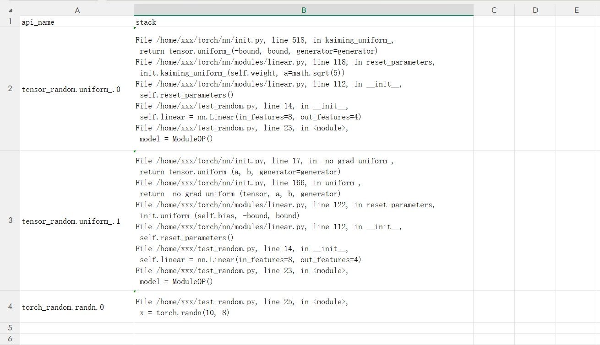

# PyTorch场景精度数据采集

## 简介

msProbe工具通过在训练脚本中添加`PrecisionDebugger`接口并启动训练的方式，采集模型在运行过程中的精度数据。

**功能特点**

- **多粒度数据采集**：支持L0（模块级）、L1（API级）以及mix（L0+L1）的不同粒度的数据采集
- **多种dump模式**：提供statistics、tensor、acc_check、structure、overflow_check等多种采集模式
- **灵活的配置选项**：通过config.json文件可以精确控制采集范围

## 使用前准备

**环境准备**

安装msProbe工具，详情请参见《[msProbe安装指南](../msprobe_install_guide.md)》。

**约束**

- 仅支持PyTorch框架，暂不支持PyTorch2.7及以上版本的dynamo场景。
- 因PyTorch框架自动微分机制的限制，dump数据中可能会缺少原地操作模块/API及其上一个模块/API的反向数据。
- 使用msProbe工具后loss/gnorm发生变化：可能是工具中的item操作引入同步，PyTorch或MindSpore框架的hook机制等原因导致的，详见《FAQ》中[模型计算结果改变原因分析](../faq.md#模型计算结果改变原因分析)。

## 快速入门

以下通过一个简单的示例，展示如何在PyTorch模型中使用msProbe工具进行精度数据采集。这个示例定义了一个nn.Module类型的简单网络，使用原型函数PrecisionDebugger进行数据采集，插入代码如下高亮显示。

```diff
 import torch
 import torch.nn as nn
 import torch.nn.functional as F

+# 导入工具的数据采集接口
+from msprobe.pytorch import PrecisionDebugger, seed_all
+
+# 在模型训练开始前固定随机性
+seed_all()
+# 在模型训练开始前实例化PrecisionDebugger
+debugger = PrecisionDebugger(config_path="./config.json")

 # 定义网络
 class ModuleOP(nn.Module):
     def __init__(self) -> None:
         super().__init__()
         self.linear = nn.Linear(in_features=8, out_features=4)

     def forward(self, x):
         x1 = self.linear(x)
         r1 = F.relu(x1)
         return r1

 if __name__ == "__main__":
     model = ModuleOP()

+    debugger.start(model=model)  # 开启数据dump

     x = torch.randn(10, 8)
     out = model(x)
     loss = out.sum()
     loss.backward()

+    debugger.stop()  # 关闭数据dump，可继续开启数据dump，采集数据会记录在同一个step中
+    debugger.step()  # 结束数据dump，若继续开启数据dump，采集数据将记录在下一个step中
```

其中config.json文件为精度数据采集的配置文件，需要自行创建，详细说明请参见[config.json介绍](./config_json_introduct.md)。下面是一个简单的config.json文件示例：

```json
{
    "task": "statistics",
    "dump_path": "/home/data_dump",
    "rank": [],
    "step": [],
    "level": "L1",
    "async_dump": false,
    "extra_info": true,

    "statistics": {
        "scope": [], 
        "list": [],
        "tensor_list": [],
        "data_mode": ["all"],
        "summary_mode": "statistics"
    }
}
```

## 数据采集功能介绍

### 功能说明

根据需求选择合适的功能(task)类型，task配置项详细说明请参见[config.json介绍](./config_json_introduct.md#参数介绍)。

| 调试需求   | 推荐配置        | 特点              |
| ------ | --------------- | --------------- |
| 初步精度分析 | task="statistics"      | 资源占用低，快速获取统计信息  |
| 深度精度分析 | task="tensor"          | 采集完整数据，支持详细分析   |
| 确定性问题分析 | task="statistics"<br>summary_mode="md5"          | 采集统计信息和tensor的CRC-32校验值，快速分析确定性问题   |

### 使用示例

#### dump采集基础示例

dump采集基础示例如下，示例代码中的高亮显示为需要在用户脚本中添加的代码。

<details>
<summary><b>单击展开示例</b></summary>

```diff
+# 导入工具数据采集接口，尽量在迭代训练文件导包后的位置执行seed_all和实例化PrecisionDebugger
+from msprobe.pytorch import seed_all, PrecisionDebugger
+# 在模型训练开始前固定随机性
+seed_all()
+# PrecisionDebugger实例化，加载dump配置文件
+debugger = PrecisionDebugger(config_path="./config.json")

 # 模型、损失函数的定义及初始化等操作
 # ...

 # 数据集迭代的位置一般为模型训练开始的位置
 for data, label in data_loader:
+    debugger.start(model)  # 开启数据dump

     # 如下是模型每个step执行的逻辑
     output = model(data)
     # ...
     # 计算梯度
     loss.backward()
     # 更新参数
     optimizer.step()

+    debugger.stop()  # 关闭数据dump，可继续开启数据dump，采集数据会记录在同一个step中
+    debugger.step()  # 结束数据dump，若继续开启数据dump，采集数据将记录在下一个step中
```

</details><br>

示例接口介绍：

- [seed_all](#seed_all)：用于固定网络中的随机性和开启确定性计算。
- [PrecisionDebugger](#precisiondebugger)：通过加载dump配置文件的方式来确定dump操作的详细配置。
- [start](#start)：启动精度数据采集。
- [stop](#stop)：停止精度数据采集。
- [step](#step)：结束一个step的数据采集，完成所有数据落盘并更新dump参数。

更多接口介绍请参见[接口介绍](#接口介绍)章节。

**注意事项**

- `PrecisionDebugger` 提供 dump 动态启停能力，通过配置文件中的 `dump_enable` 字段进行控制：在同一训练/推理任务中可按需动态开启或关闭 dump。详细说明请参见 [config.json介绍](./config_json_introduct.md) 中的 `dump_enable` 参数说明。

- 本工具提供固定的 API 支持列表，若需要删除或增加 dump 的 API，可以在 [support_wrap_ops.yaml](../../../python/msprobe/pytorch/dump/api_dump/support_wrap_ops.yaml) 文件内手动修改，如下示例：

  ```yaml
  functional:  # functional为算子类别，找到对应的类别，在该类别下按照下列格式删除或添加API
    - conv1d
    - conv2d
    - conv3d
  ```

  删除API的场景：部分模型代码逻辑会存在API原生类型校验，工具执行dump操作时，对模型的API封装可能与模型的原生API类型不一致，此时可能引发校验失败，详见《FAQ》中“[异常情况](../faq.md#异常情况)”的第10条。

- 如果需要采集自定义API的精度数据，需要先向工具注册该API，注册方式请参见[register_custom_api](#register_custom_api)。

#### 采集函数模块化数据

采集函数模块化数据示例如下，示例代码中的高亮显示为需要在用户脚本中添加的代码。

<details>
<summary><b>单击展开示例</b></summary>

```diff
 # 根据需要import包
 import torch
 import torch.nn as nn
 import torch.nn.functional as F

+# 导入工具的数据采集接口
+from msprobe.pytorch import PrecisionDebugger, module_dump, module_dump_end

+# 在模型训练开始前实例化PrecisionDebugger
+debugger = PrecisionDebugger(config_path='./config.json')

 # 定义网络
 class ModuleOP(nn.Module):
     def __init__(self) -> None:
         super().__init__()
         self.linear_1 = nn.Linear(in_features=8, out_features=4)
         self.linear_2 = nn.Linear(in_features=4, out_features=2)

     def forward(self, x):
         x1 = self.linear_1(x)
         x2 = self.linear_2(x1)
         r1 = F.relu(x2)
         return r1

 if __name__ == "__main__":
     module = ModuleOP()

+    debugger.start()  # 开启数据dump

     x = torch.randn(10, 8)
     # ...                              # start和module_dump接口之间的数据正常dump
+    module_dump(module, "MyModuleOP")  # 开启模块级精度数据dump
     out = module(x)  # module内部的child modules或API将不会被dump
+    module_dump_end()  # 关闭模块级精度数据dump
     loss = out.sum()  # module_dump_end和stop接口之间的数据正常dump
     loss.backward()

+    debugger.stop()  # 关闭数据dump，可继续开启数据dump，采集数据会记录在同一个step中
+    debugger.step()  # 结束数据dump，若继续开启数据dump，采集数据将记录在下一个step中
```

</details><br>

#### 跨文件采集数据

跨文件采集数据示例如下，示例代码中的高亮显示为需要在用户脚本中添加的代码。

<details>
<summary><b>单击展开示例</b></summary>

为了确保所有API都被工具封装，PrecisionDebugger的实例化通常放在训练工程的入口位置，但有的时候，模型定义会在另一个文件中。

假设有两个文件，`train.py`（训练工程入口文件）`module.py`（模型定义文件），为了采集module.py中定义的ModuleOP模块中某些子模块或API的前反向数据，需要在`train.py`和`module.py`文件中分别导入PrecisionDebugger并进行如下配置。

train.py文件：

```diff
 # 根据需要import包
 import torch
 from module import ModuleOP

+# 导入工具的数据采集接口
+from msprobe.pytorch import PrecisionDebugger

+# 将PrecisionDebugger的实例化放在文件的开始位置，即导包后的位置，确保所有API都被封装
+debugger = PrecisionDebugger(config_path='./config.json')

 if __name__ == "__main__":
     module = ModuleOP()

     x = torch.randn(10, 8)
     out = module(x)
     loss = out.sum()
     loss.backward()
```

module.py文件：

```diff
 import torch
 import torch.nn as nn
 import torch.nn.functional as F

+from msprobe.pytorch import PrecisionDebugger

 # 定义网络
 class ModuleOP(nn.Module):
     def __init__(self) -> None:
         super().__init__()
         self.linear_1 = nn.Linear(in_features=8, out_features=4)
         self.linear_2 = nn.Linear(in_features=4, out_features=2)

     def forward(self, x):
+        PrecisionDebugger.start()
         x1 = self.linear_1(x)
+        PrecisionDebugger.stop()
         x2 = self.linear_2(x1)
         r1 = F.relu(x2)
         return r1

```

</details><br>

#### 推理模型采集指定token_range

推理模型采集指定token_range示例如下，示例代码中的高亮显示为需要在用户脚本中添加的代码。

<details>
<summary><b>单击展开示例</b></summary>

```diff
 from vllm import LLM, SamplingParams
+from msprobe.pytorch import PrecisionDebugger, seed_all

+# 在模型训练开始前固定随机性
+seed_all()
+# 请勿将PrecisionDebugger的初始化流程插入到循环代码中
+debugger = PrecisionDebugger(config_path="./config.json", dump_path="./dump_path")
 # 模型定义及初始化等操作
 prompts = ["Hello, my name is"]
 sampling_params = SamplingParams(temperature=0.8, top_p=0.95)
 llm = LLM(model='...')
 model = llm.llm_engine.model_executor.driver_worker.worker.model_runner.get_model()
+# 开启数据dump, 指定采集推理模型逐字符循环推理中的第1~3次
+debugger.start(model=model, token_range=[1, 3])
 # 推理模型生成的逻辑
 output = llm.generate(prompts, sampling_params=sampling_params)
+# 关闭数据dump并落盘
+debugger.stop()
+debugger.step()
```

</details><br>

### 输出说明

完成精度数据采集后，将打印dump数据文件生成路径dump_path，如下所示：

```ColdFusion
dump.json is at ./dump_path/step*
```

*表示step的编号，当打印的step编号为最后一个step时，表示dump结束。每个step目录下会保存dump数据文件。

## dump结果文件介绍

### dump目录说明

训练结束后，工具将dump的数据保存在dump_path参数指定的目录下。  
目录结构示例如下：
<details>
<summary><b>单击展开目录结构</b></summary>

```txt
├── dump_path
│   ├── step0
│   |   ├── rank0
│   |   │   ├── dump_tensor_data
|   |   |   |    ├── Tensor.permute.1.forward.pt
|   |   |   |    ├── Functional.linear.5.backward.output.pt            # 命名格式为{api_type}.{api_name}.{API调用次数}.{forward/backward}.{input/output}.{参数序号}, 其中，“参数序号”表示该API的第n个输入或输出，例如1，则为第一个参数，若该参数为list格式，则根据list继续排序，例如1.1，表示该API的第1个参数的第1个元素。
|   |   |   |    ...
|   |   |   |    ├── Module.conv1.Conv2d.forward.0.input.0.pt          # 命名格式为{Module}.{module_name}.{class_name}.{forward/backward}.{调用次数}.{input/output}.{参数序号}, 其中，“参数序号”表示该Module的第n个参数，例如1，则为第一个参数，若该参数为list格式，则根据list继续排序，例如1.1，表示该Module的第1个参数的第1个元素。
|   |   |   |    ├── Module.conv1.Conv2d.forward.0.parameters.bias.pt  # 模块参数数据：命名格式为{Module}.{module_name}.{class_name}.forward.{调用次数}.parameters.{parameter_name}。
|   |   |   |    └── Module.conv1.Conv2d.parameters_grad.0.weight.pt     # 模块参数梯度数据：命名格式为{Module}.{module_name}.{class_name}.parameters_grad.{参数的grad_fn触发次数}.{parameter_name}，其中，参数梯度中的计数是grad_fn触发次数，不是模块的调用次数。
|   |   |   |                                                          # 当dump时传入的model参数为List[torch.nn.Module]或Tuple[torch.nn.Module]时，模块级数据的命名中包含该模块在列表中的索引index，命名格式为{Module}.{index}.*，*表示以上三种模块级数据的命名格式，例如：Module.0.conv1.Conv2d.forward.0.input.0.pt。
│   |   |   ├── dump.json
│   |   |   ├── stack.json
│   |   |   ├── dump_error_info.log
│   |   |   └── construct.json
│   |   ├── rank1
|   |   |   ├── dump_tensor_data
|   |   |   |   └── ...
│   |   |   ├── dump.json
│   |   |   ├── stack.json
│   |   |   ├── dump_error_info.log
|   |   |   └── construct.json
│   |   ├── ...
│   |   |
|   |   └── rank7
│   ├── step1
│   |   ├── ...
│   ├── step2
```

</details><br>

* `rank`：设备ID，每张卡的数据保存在对应的`rank{ID}`目录下。当训练进程无法获取到`rank`信息时，当前进程的数据保存在`proc{pid}`，pid为进程ID，`proc`的详细介绍如下：
  * ①在非分布式场景下，如单进程训练或单卡训练中，训练进程没有`rank`信息，此时数据保存在`proc{pid}`，比对、分级可视化和溢出检测功能支持该目录下的数据解析。
  * ②在大模型训练过程中，可能既存在`rank`目录又存在`proc`目录，原因是一些进程可能仅在CPU上完成一些数据预处理操作，没有`rank`信息，此时目录名称为`proc{pid}`，这部分数据一般不存在精度问题，比对、分级可视化和溢出检测等功能将不会支持该目录下的数据解析。
* `dump_tensor_data`：保存采集到的张量数据。
* `dump.json`：保存API或Module前反向数据的统计量信息。包含dump数据的API名称或Module名称，各数据的dtype、
  shape、max、min、mean、L2norm（L2范数，平方根）统计信息，以及根据`summary_mode`
  配置输出的校验值（`md5`对应CRC-32字段`md5`，`xor`对应XOR校验字段`md5`）。具体介绍可参考[dump.json文件说明](#dumpjson文件说明)。
* `dump_error_info.log`：仅在dump工具报错时拥有此记录日志，用于记录dump错误日志。
* `stack.json`：API/Module的调用栈信息。
* `construct.json`：分层分级结构，level为L1时，construct.json内容为空。

dump过程中，pt文件在对应算子或者模块被执行后就落盘，而json文件则需要在正常执行PrecisionDebugger.stop()
后才会写入完整数据，异常的程序终止会保存终止前被执行算子的相关pt文件，可能会导致json文件中数据丢失。

pt文件保存的前缀和PyTorch对应关系如下：

| 前缀          | Torch模块             |
|-------------|---------------------|
| Tensor      | torch.Tensor        |
| Torch       | torch               |
| Functional  | torch.nn.functional |
| NPU         | NPU亲和算子             |
| VF          | torch._VF           |
| Aten        | torch.ops.aten      |
| Distributed | torch.distributed   |
| MindSpeed   | mindspeed.ops       |
| Triton   | triton       |

### dump.json文件说明

#### L0级别

L0级别的dump.json文件包括模块的前反向的输入输出，以及模块的参数和参数梯度。以PyTorch的Conv2d模块为例，网络中模块调用代码为:  
`output = self.conv2(input) # self.conv2 = torch.nn.Conv2d(64, 128, 5, padding=2, bias=True)`

dump.json文件中包含以下数据名称：

- `Module.conv2.Conv2d.forward.0`
  ：模块的前向数据，其中input_args为模块的输入数据（位置参数），input_kwargs为模块的输入数据（关键字参数），output为模块的输出数据，parameters为模块的参数数据，包括权重（weight）和偏置（bias）。
- `Module.conv2.Conv2d.parameters_grad.0`：模块的参数梯度数据，包括权重（weight）和偏置（bias）的梯度。
- `Module.conv2.Conv2d.backward.0`：模块的反向数据，其中input为模块反向的输入梯度（对应前向输出的梯度），output为模块的反向输出梯度（对应前向输入的梯度）。

**说明**：当dump时传入的model参数为List[torch.nn.Module]或Tuple[torch.nn.Module]
时，模块级数据的命名中包含该模块在列表中的索引index，命名格式为`{Module}.{index}.*`，*
表示以上三种模块级数据的命名格式，例如：`Module.0.conv1.Conv2d.forward.0`。

dump.json文件如下：
<details>
<summary><b>单击展开dump.json文件</b></summary>

```json
{
  "task": "tensor",
  "level": "L0",
  "framework": "pytorch",
  "dump_data_dir": "/dump/path",
  "data": {
    "Module.conv2.Conv2d.forward.0": {
      "input_args": [
        {
          "type": "torch.Tensor",
          "dtype": "torch.float32",
          "shape": [
            8,
            16,
            14,
            14
          ],
          "Max": 1.638758659362793,
          "Min": 0.0,
          "Mean": 0.2544615864753723,
          "Norm": 70.50277709960938,
          "requires_grad": true,
          "data_name": "Module.conv2.Conv2d.forward.0.input.0.pt"
        }
      ],
      "input_kwargs": {},
      "output": [
        {
          "type": "torch.Tensor",
          "dtype": "torch.float32",
          "shape": [
            8,
            32,
            10,
            10
          ],
          "Max": 1.6815717220306396,
          "Min": -1.5120246410369873,
          "Mean": -0.025344856083393097,
          "Norm": 149.65576171875,
          "requires_grad": true,
          "data_name": "Module.conv2.Conv2d.forward.0.output.0.pt"
        }
      ],
      "parameters": {
        "weight": {
          "type": "torch.Tensor",
          "dtype": "torch.float32",
          "shape": [
            32,
            16,
            5,
            5
          ],
          "Max": 0.05992485210299492,
          "Min": -0.05999220535159111,
          "Mean": -0.0006165213999338448,
          "Norm": 3.421217441558838,
          "requires_grad": true,
          "data_name": "Module.conv2.Conv2d.forward.0.parameters.weight.pt"
        },
        "bias": {
          "type": "torch.Tensor",
          "dtype": "torch.float32",
          "shape": [
            32
          ],
          "Max": 0.05744686722755432,
          "Min": -0.04894155263900757,
          "Mean": 0.006410328671336174,
          "Norm": 0.17263513803482056,
          "requires_grad": true,
          "data_name": "Module.conv2.Conv2d.forward.0.parameters.bias.pt"
        }
      }
    },
    "Module.conv2.Conv2d.parameters_grad.0": {
      "weight": [
        {
          "type": "torch.Tensor",
          "dtype": "torch.float32",
          "shape": [
            32,
            16,
            5,
            5
          ],
          "Max": 0.018550323322415352,
          "Min": -0.008627401664853096,
          "Mean": 0.0006675920449197292,
          "Norm": 0.26084786653518677,
          "requires_grad": false,
          "data_name": "Module.conv2.Conv2d.parameters_grad.0.weight.pt"
        }
      ],
      "bias": [
        {
          "type": "torch.Tensor",
          "dtype": "torch.float32",
          "shape": [
            32
          ],
          "Max": 0.014914230443537235,
          "Min": -0.006656786892563105,
          "Mean": 0.002657240955159068,
          "Norm": 0.029451673850417137,
          "requires_grad": false,
          "data_name": "Module.conv2.Conv2d.parameters_grad.0.bias.pt"
        }
      ]
    },
    "Module.conv2.Conv2d.backward.0": {
      "input": [
        {
          "type": "torch.Tensor",
          "dtype": "torch.float32",
          "shape": [
            8,
            32,
            10,
            10
          ],
          "Max": 0.0015069986693561077,
          "Min": -0.001139344065450132,
          "Mean": 3.3215508210560074e-06,
          "Norm": 0.020567523315548897,
          "requires_grad": false,
          "data_name": "Module.conv2.Conv2d.backward.0.input.0.pt"
        }
      ],
      "output": [
        {
          "type": "torch.Tensor",
          "dtype": "torch.float32",
          "shape": [
            8,
            16,
            14,
            14
          ],
          "Max": 0.0007466732058674097,
          "Min": -0.00044813455315306783,
          "Mean": 6.814070275140693e-06,
          "Norm": 0.01474067009985447,
          "requires_grad": false,
          "data_name": "Module.conv2.Conv2d.backward.0.output.0.pt"
        }
      ]
    }
  }
}
```

</details><br>

#### L1级别

L1级别的dump.json文件包括API的前反向的输入输出。以PyTorch的relu函数为例，网络中API调用代码为：
`output = torch.nn.functional.relu(input)`

dump.json文件中包含以下数据名称：

- `Functional.relu.0.forward`：API的前向数据，其中input_args为API的输入数据（位置参数），input_kwargs为API的输入数据（关键字参数），output为API的输出数据。
- `Functional.relu.0.backward`：API的反向数据，其中input为API的反向输入梯度（对应前向输出的梯度），output为API的反向输出梯度（对应前向输入的梯度）。

dump.json文件如下：
<details>
<summary><b>单击展开dump.json文件</b></summary>

```json
{
  "task": "tensor",
  "level": "L1",
  "framework": "pytorch",
  "dump_data_dir": "/dump/path",
  "data": {
    "Functional.relu.0.forward": {
      "input_args": [
        {
          "type": "torch.Tensor",
          "dtype": "torch.float32",
          "shape": [
            32,
            16,
            28,
            28
          ],
          "Max": 1.3864083290100098,
          "Min": -1.3364859819412231,
          "Mean": 0.03711778670549393,
          "Norm": 236.20692443847656,
          "requires_grad": true,
          "data_name": "Functional.relu.0.forward.input.0.pt"
        }
      ],
      "input_kwargs": {},
      "output": [
        {
          "type": "torch.Tensor",
          "dtype": "torch.float32",
          "shape": [
            32,
            16,
            28,
            28
          ],
          "Max": 1.3864083290100098,
          "Min": 0.0,
          "Mean": 0.16849493980407715,
          "Norm": 175.23345947265625,
          "requires_grad": true,
          "data_name": "Functional.relu.0.forward.output.0.pt"
        }
      ]
    },
    "Functional.relu.0.backward": {
      "input": [
        {
          "type": "torch.Tensor",
          "dtype": "torch.float32",
          "shape": [
            32,
            16,
            28,
            28
          ],
          "Max": 0.0001815402356442064,
          "Min": -0.00013352684618439525,
          "Mean": 0.00011915402356442064,
          "Norm": 0.007598237134516239,
          "requires_grad": false,
          "data_name": "Functional.relu.0.backward.input.0.pt"
        }
      ],
      "output": [
        {
          "type": "torch.Tensor",
          "dtype": "torch.float32",
          "shape": [
            32,
            16,
            28,
            28
          ],
          "Max": 0.0001815402356442064,
          "Min": -0.00012117840378778055,
          "Mean": 2.0098118724831693e-08,
          "Norm": 0.006532244384288788,
          "requires_grad": false,
          "data_name": "Functional.relu.0.backward.output.0.pt"
        }
      ]
    }
  }
}  
```

</details><br>

#### mix级别

mix级别的dump.json文件同时包括L0和L1级别的dump数据，文件格式与上述示例相同。

## 扩展功能

### 采集随机性API

**功能说明**

通过[random_save](#random_save)接口，实现寻找模型脚本中所有随机性API的调用位置，并将结果输出到csv表格，帮助用户快速定位模型中的随机数生成点。

**使用示例**

```diff
 import torch
 import torch.nn as nn
 import torch.nn.functional as F

+# 导入工具寻找随机性API的接口，网络中的随机性API会被保存在output路径下。
+from msprobe.pytorch import random_save
+random_save(output_path="./output")

 # 定义网络
 class ModuleOP(nn.Module):
     def __init__(self) -> None:
         super().__init__()
         self.linear = nn.Linear(in_features=8, out_features=4)

     def forward(self, x):
         x1 = self.linear(x)
         r1 = F.relu(x1)
         return r1

 if __name__ == "__main__":
     model = ModuleOP()

     x = torch.randn(10, 8)
     out = model(x)
     loss = out.sum()
     loss.backward()
```

**输出说明**

模型脚本执行完成后，在指定的output_path路径下生成csv文件，若执行的进程能获取到rank信息，则结果文件名称为`random_rank{id}_{timestamp}.csv`，否则为`random_proc{pid}_{timestamp}.csv`。

csv结果文件内容介绍如下：



| 参数     | 说明                        |
| -------- | --------------------------- |
| api_name | 模型脚本中随机性API的名称。 |
| stack    | 随机性API对应的堆栈信息。   |

## 接口介绍

### PrecisionDebugger

**功能说明**

通过加载dump配置文件的方式来确定dump操作的详细配置。此接口的初始化需与采集目标在同一个进程中，否则将无法采集目标数据。

**函数原型**

```Python
debugger = PrecisionDebugger(config_path=None, task=None, dump_path=None, level=None, step=None)
```

**参数说明**

- config_path：可选参数，str类型，指定dump配置文件路径，参数示例："./config.json"。未配置该路径时，默认使用[config.json](../../../python/msprobe/config.json)
  文件的默认配置，配置选项含义可见[config.json介绍](./config_json_introduct.md)。
- 其他参数均在config.json文件中可配，详细配置可见[config.json介绍](./config_json_introduct.md)。
- 此接口的参数均不是必要的（均不配置的情况下默认采集所有 rank 和 step 的 L1 级别的统计数据），且优先级高于config.json
  文件中的配置，但可配置的参数相比config.json较少。

**返回值说明**

debugger是PrecisionDebugger类的实例对象，该实例对象提供**start**、**stop**和**step**等函数开启和结束数据采集的功能。

**调用示例**

请参见[dump采集基础示例](#dump采集基础示例)。

### start

**功能说明**

启动精度数据采集。在模型初始化之后的位置添加。需要与**stop**和**step**等函数一起搭配使用。

**函数原型**

```Python
debugger.start(model=None, token_range=None, rank_id=None)
```

**参数说明**

- model：指定需要采集Module级数据的模型，支持传入torch.nn.Module、list[torch.nn.Module]或Tuple[torch.nn.Module]类型，默认未配置。

  level配置为"L0"、"mix"或token_range不为None时，必须在该接口中配置该参数。

  对于复杂模型，如果仅需要监测一部分（如model.A，model.A extends torch.nn.Module），传入需要监测的部分（如model.A）即可。

  注意：传入的当前层不会被dump，工具只会dump传入层的子层级。如传入了model.A，A本身不会被dump，而是会dumpA.x, A.x.xx等。

- token_range：指定推理模型采集时的token循环始末范围，支持传入[int, int]类型，代表[start, end]，范围包含边界，默认未配置。

- rank_id: 指定自定义的rank ID，支持传入大于等于0的整数。默认未配置，则工具基于torch.distributed.get_rank接口获取rank ID；
  配置此参数后，dump的结果中，rank文件夹名称中的{ID}将使用该参数所配置的值。

  注意：通常情况下，用户无需手动配置rank_id参数，工具默认通过torch.distributed.get_rank接口（下面简称get_rank接口）可自动获取多卡多进程的唯一rank ID；
  然而，在某些特殊场景下，get_rank接口可能无法正确获取唯一的rank ID。例如，在推理框架sglang的DP推理场景中，各DP worker之间是独立的分布式集群，导致get_rank接口返回重复的rank ID，进而引发dump结果中rank文件夹同名覆盖的问题，造成dump数据丢失。
  
  针对此类特殊场景，可通过配置rank_id参数为rank文件夹命名，但需要保证rank_id在各个进程中唯一。该值通常可在模型脚本或训练推理框架中获取，例如推理框架sglang中的self.gpu_id，其在每个进程中均保持唯一性。
  
  配置示例：`debugger.start(rank_id=self.gpu_id)`

**返回值说明**

无

**调用示例**

请参见[dump采集基础示例](#dump采集基础示例)。

### stop

**功能说明**

停止精度数据采集。在**start**接口之后的任意位置添加。

若**stop**函数添加在反向计算代码（如loss.backward）之后，则会采集**start**和该函数之间的前反向数据。

若**stop**函数添加在反向计算代码之前，则需要将**step**函数添加到反向计算代码之后，才能采集**start**
和该函数之间的前反向数据。

**注意事项**

**stop**函数必须调用，否则可能导致精度数据落盘不全。

**函数原型**

```Python
debugger.stop()
```

**返回值说明**

无

**调用示例**

请参见[dump采集基础示例](#dump采集基础示例)。

### step

**功能说明**

结束一个step的数据采集，完成所有数据落盘并更新dump参数。在一个step结束的位置添加，且必须在**stop**函数之后的位置调用。

**注意事项**

该函数需要配合**start**和**stop**函数使用，尽量添加在反向计算代码（如loss.backward）之后，否则可能会导致反向数据丢失。

**函数原型**

```Python
debugger.step()
```

**返回值说明**

无

**调用示例**

请参见[dump采集基础示例](#dump采集基础示例)。

### module_dump

**功能说明**
开启模块级精度数据dump。该接口为函数模块化接口，即只会dump输入的模块数据，不会dump子模块和模块内API的数据。

**注意事项**

该函数需要配合start、stop和step等接口使用。

**函数原型**

```Python
module_dump(module, module_name)
```

**参数说明**

- module：网络中实例化好的nn.Module类对象。torch.nn.Module类型，必选。
- module_name：用户自定义该module名称，主要用于dump数据的命名。str类型，必选。

**返回值说明**

无

**调用示例**

请参见[采集函数模块化数据](#采集函数模块化数据)。

### module_dump_end

**功能说明**

结束模块级精度数据dump。在module_dump和module_dump_end之间的API或者Module，除了传入的module，其他数据均不会被dump。
在执行完module_dump_end后数据恢复正常的dump模式。

**函数原型**

```Python
module_dump_end()
```

**返回值说明**

无

**调用示例**

请参见[采集函数模块化数据](#采集函数模块化数据)。

### save

**功能说明**

单点保存网络执行过程中前反向数值，并以统计值数据或张量文件落盘。

**函数原型**

```python
save(variable, name, save_backward=True)
```

**参数说明**

| 参数名称          | 参数含义     | 支持数据类型                                           | 是否必选 |
|---------------|----------|--------------------------------------------------|------|
| variable      | 需要保存的变量  | dict, list, tuple, torch.tensor, int, float, str | 是    |
| name          | 指定的名称    | str                                              | 是    |
| save_backward | 是否保存反向数据 | boolean                                          | 否    |

**返回值说明**

无

**调用示例**

请参见[单点保存工具使用介绍](./debugger_save_instruct.md)。

### set_init_step

**功能说明**

设置起始step数，step数默认从0开始计数，使用该接口后step从指定值开始计数。该函数需要写在训练迭代的循环开始前，不能写在循环内。

**函数原型**

```Python
debugger.set_init_step(step)
```

**参数说明**

step：指定的起始step数。

**返回值说明**

无

**调用示例**

无

### register_custom_api

**功能说明**

注册用户自定义的API到工具用于API级数据dump。

**函数原型**

```Python
debugger.register_custom_api(module, api, api_prefix)
```

**参数说明**

以torch.matmul api为例

- module：必选，API所属的包，即传入torch。
- api：必选，API的名称，str类型，即传入"matmul"。
- api_prefix：可选，[dump.json](#dumpjson文件说明)中api名的前缀，默认为包名的字符串格式, 即"torch"。

**返回值说明**

无

**调用示例**

```diff
+# 需要导入自定义算子的模块
+import module_a
+from msprobe.pytorch import seed_all, PrecisionDebugger
+seed_all()
+debugger = PrecisionDebugger(config_path="./config.json")
+# 假设自定义算子的调用方式是module_a.compute(args)，注册方式如下。
+debugger.register_custom_api(module = module_a, api = "compute")

 # 模型、损失函数的定义及初始化等操作
 # ...

 # 数据集迭代的位置一般为模型训练开始的位置
 for data, label in data_loader:
+    debugger.start(model)  # 开启数据dump

     # 如下是模型每个step执行的逻辑
     output = model(data)
     # ...
     # 计算梯度
     loss.backward()
     # 更新参数
     optimizer.step()

+    debugger.stop()  # 关闭数据dump，可继续开启数据dump，采集数据会记录在同一个step中
+    debugger.step()  # 结束数据dump，若继续开启数据dump，采集数据将记录在下一个step中

+# 取消该API的dump，根据实际情况按需使用。
+debugger.restore_custom_api(module_a, "compute")
```

### restore_custom_api

**功能说明**

恢复用户原有的自定义的API，取消该API的dump。

**函数原型**

```Python
debugger.restore_custom_api(module, api)
```

**参数说明**

以torch.matmul api为例

- module:：必选，API所属的包，即传入torch。
- api：必选，API的名称，str类型，即传入"matmul"。

**返回值说明**

无

**调用示例**

请参见[register_custom_api](#register_custom_api)。

### seed_all

**功能说明**

用于控制模型网络中的随机性，支持固定随机种子以及启用确定性计算，以确保实验的可复现性。

**函数原型**

```python
seed_all(seed=1234, mode=False, rm_dropout=False, is_enhanced=False)
```

**参数说明**

- seed：随机性种子。参数示例：seed=1000。默认为1234，非必选。
- mode：确定性计算模式。可配置True或False。参数示例：mode=True。默认为False。非必选（注意：确定性计算会导致API执行性能降低，建议在发现模型多次执行结果不同的情况下开启）。
- rm_dropout：控制dropout失效的开关。可配置True或False，默认为False，非必选。参数示例：rm_dropout=True。
  该参数设置为True后，工具会自动将`torch.nn.functional.dropout`、`torch.nn.functional.dropout2d`、`torch.nn.functional.dropout3d`、`torch.nn.Dropout`、`torch.nn.Dropout2d`、`torch.nn.Dropout3d`
  的接口参数p置为0，以避免因随机dropout造成的网络随机性。注意：通过rm_dropout控制dropout失效需要在初始化dropout实例前调用才能生效。
- is_enhanced：增强随机性固定的开关。可配置True或False，默认为False，非必选。参数示例：is_enhanced=True。开启该功能后，将进一步固定PyTorch、NumPy以及Python内置随机数生成器的状态。在同一个进程或不同进程中多次执行相同的随机性API，每次生成的随机值都完全相同。这有助于在更复杂的随机场景下实现严格的可复现性。

**返回值说明**

无

**调用示例**

```diff
 import torch
+from msprobe.pytorch import seed_all

 # seed_all仅固定随机种子和开启确定性计算。
+seed_all(seed=1234, mode=True)
 num1 = torch.mean(torch.randn(2,2))
 print(num1)  # tensor(-0.0866)
 num2 = torch.mean(torch.randn(2,2))
 print(num2)  # tensor(0.2038)
```

上述脚本重复执行多次，每次执行结果num1和num2是能对应的，但该脚本内执行两次相同的随机性API，生成的结果是不一样的，即num1不等于num2。

```diff
 import torch
+from msprobe.pytorch import seed_all

 # seed_all固定随机种子和开启确定性计算，并开启随机数固定增强功能。
+seed_all(seed=1234, mode=True, is_enhanced=True)
 num1 = torch.mean(torch.randn(2,2))
 print(num1)  # tensor(-0.0866)
 num2 = torch.mean(torch.randn(2,2))
 print(num2)  # tensor(-0.0866)
```

上述脚本中执行两次相同的随机性API，生成的结果能完全相同，即使该脚本多次重复执行也能确保两个值完全相同。

**其他说明**

当前工具dump功能默认不会固定随机性，若希望每次采集的数据保持一致，建议在dump数据前调用seed_all接口。

seed_all函数可固定随机数的范围如下表:

| API                                      | 固定随机数                                      |
|------------------------------------------|--------------------------------------------|
| os.environ['PYTHONHASHSEED'] = str(seed) | 禁止Python中的hash随机化                          |
| os.environ['HCCL_DETERMINISTIC'] = True  | 固定通信算子计算的确定性                               |
| np.random.seed(seed)                     | 设置numpy中随机生成器的种子                           |
| torch.manual_seed(seed)                  | 设置当前CPU的随机种子                               |
| torch.cuda.manual_seed(seed)             | 设置当前GPU的随机种子                               |
| torch.cuda.manual_seed_all(seed)         | 设置所有GPU的随机种子                               |
| torch_npu.npu.manual_seed(seed)          | 设置当前NPU的随机种子                               |
| torch_npu.npu.manual_seed_all(seed)      | 设置所有NPU的随机种子                               |
| torch.use_deterministic_algorithms(True) | CUDA/CANN使能确定性计算（注意mode为True时才会调用该方法开启确定性） |
| torch.backends.cudnn.enable=False        | 关闭cuDNN                                    |
| torch.backends.cudnn.benchmark=False     | cuDNN确定性地选择算法                              |
| torch.backends.cudnn.deterministic=True  | cuDNN仅使用确定性的卷积算法                           |
| torch.nn.functional.dropout              | 将dropout的接口参数p置为0                          |
| torch.nn.functional.dropout2d            | 将dropout2d的接口参数p置为0                        |
| torch.nn.functional.dropout3d            | 将dropout3d的接口参数p置为0                        |
| torch.nn.Dropout                         | 将Dropout的接口参数p置为0                          |
| torch.nn.Dropout2d                       | 将Dropout2d的接口参数p置为0                        |
| torch.nn.Dropout3d                       | 将Dropout3d的接口参数p置为0                        |

需要保证CPU或GPU以及NPU的模型输入完全一致，dump数据的比对才有意义，seed_all并不能保证模型输入完全一致，如下表所示场景需要保证输入的一致性。

| 场景          | 固定方法       |
|-------------|------------|
| 数据集的shuffle | 关闭shuffle。 |

关闭shuffle示例如下：

```python
train_loader = torch.utils.data.DataLoader(
    train_dataset,
    batch_size=batch_size,
    shuffle=False,
    num_workers=num_workers
)
```

### random_save

**功能说明**

寻找模型脚本中所有随机性API的调用位置，并将结果输出到csv表格，帮助用户快速定位模型中的随机数生成点。

**函数原型**

```python
random_save(output_path="./output")
```

**参数说明**

output_path：指定随机性API的保存路径。可选参数，str类型，默认值为"./output"，即默认保存在当前路径的output目录下。参数示例：output_path="./output"。

**返回值说明**

无

**调用示例**

请参见[采集随机性API](#采集随机性api)。

## 补充说明

dump "statistics"模式的性能膨胀大小与"tensor"模式采集的数据量大小，可以参考[dump基线](../baseline/pytorch_data_dump_perf_baseline.md)。
