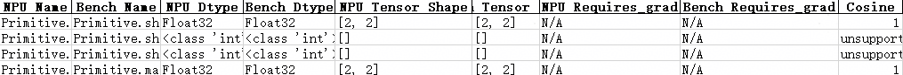

# MindSpore场景精度调试工具快速入门

## 概述

本文介绍MindSpore场景精度调试工具快速入门，主要针对训练开发流程中的模型精度调试环节使用的开发工具进行介绍。

基于昇腾开发的大模型或者是从GPU迁移到昇腾NPU环境的大模型，在训练过程中可能出现精度溢出、loss曲线跑飞或不收敛等异常问题。由于训练loss等指标无法精确定位问题模块，因此可以使用msProbe（MindStudio Probe，精度调试工具）进行快速定界。精度调试工具在下文均简称为msProbe。

**使用流程**

使用msProbe工具在模型精度调试中主要执行如下操作：

   1. 训练前配置检查

      识别两个环境影响精度的配置差异。

   2. 训练状态监测

      监测训练过程中计算，通信，优化器等部分出现的异常情况。

   3. 精度数据采集

      采集训练过程中的API或Module层级前反向输入输出数据。

   4. 精度预检

      扫描API数据，找出存在精度问题的API。

   5. 精度比对

      对比NPU侧和标杆环境的API数据，快速定位精度问题。

快速入门主要围绕精度数据采集和精度比对帮助用户快速上手，其他功能使用参见工具文档。

**环境准备**<a name="环境准备"></a>

1. 准备一台基于昇腾NPU的训练服务器（如Atlas A2 训练系列产品），并安装NPU驱动和固件。

2. 安装配套版本的CANN Toolkit开发套件包和ops算子包并配置CANN环境变量，以CANN 8.5.0版本为例，具体请参见《[CANN软件安装指南](https://www.hiascend.com/document/detail/zh/canncommercial/850/softwareinst/instg/instg_0000.html?Mode=PmIns&InstallType=local&OS=openEuler)》。

3. 安装框架。

   MindSpore训练场景以安装2.7.2和2.8.0版本为例，具体操作请参见《[MindSpore安装指南](https://www.mindspore.cn/install/)》。

4. 安装本工具，详情参考[msProbe工具安装指南](../msprobe_install_guide.md)。

   ```bash
   pip install mindstudio-probe --pre
   ```

## 精度数据采集

**前提条件**

- 完成[环境准备](#环境准备)。

**执行采集**

1. 准备训练脚本。

   以“mindspore_main.py”命名为例，创建训练脚本文件，昇腾NPU环境可直接拷贝[MindSpore精度数据采集代码样例](#mindspore精度数据采集代码样例)的完整代码。

2. 创建配置文件。

   以在训练脚本所在目录创建config.json配置文件为例，文件内容拷贝如下示例配置。

   ```json
   {
       "task": "statistics",
       "dump_path": "/home/dump/dump_data",
       "rank": [],
       "step": [0,1],
       "level": "L1",
       "async_dump": false,
   
       "statistics": {
           "scope": [], 
           "list": [],
           "tensor_list": [],
           "data_mode": ["all"]
       }
   }
   ```

3. 分别以MindSpore 2.7.2和MindSpore 2.8.0环境下的训练脚本（mindspore_main.py文件）中添加工具，如下所示。

   > [!NOTE] 说明
   >
   > [MindSpore精度数据采集代码样例](#mindspore精度数据采集代码样例)中的完整代码已添加工具，下列仅为说明工具接口在脚本中添加的位置。

   ```python
   ...
     7 from msprobe.mindspore import PrecisionDebugger    # 导入工具数据采集接口
     8 debugger = PrecisionDebugger(config_path="./config.json")    # PrecisionDebugger实例化，加载dump配置文件
   ...
    46 if __name__ == "__main__":
    47     step = 0
    48     # 训练模型
    49     for data, label in ds.GeneratorDataset(generator_net(), ["data", "label"]):
    50         debugger.start(model)    # 开启数据dump
    51         train_step(data, label)
    52         print(f"train step {step}")
    53         step += 1
    54         debugger.stop()    # 关闭数据dump，可继续开启数据dump，采集数据会记录在同一个step中
    55         debugger.step()    # 结束数据dump，若继续开启数据dump，采集数据将记录在下一个step中
    56     print("train finish")
   ```

   > [!NOTE] 说明
   >
   > 精度数据会占据一定的磁盘空间，可能存在磁盘写满导致服务器不可用的风险。精度数据所需空间跟模型的参数、采集开关配置、采集的迭代数量有较大关系，须用户自行保证落盘目录下的可用磁盘空间。

4. 执行训练脚本命令，工具会采集模型训练过程中的精度数据。

   ```bash
   python mindspore_main.py
   ```

   日志打印出现如下示例信息表示数据采集成功，完成采集后即可查看数据。

   ```txt
   The aip tensor hook function is successfully mounted to the model.
   msprobe: debugger.start() is set successfully
   Dump switch is turned on at step 0.
   Dump data will be saved in /home/dump/dump_data/step0.
   ```

**结果查看**

dump_path参数指定的路径下会出现如下目录结构，可以根据需求选择合适的数据进行分析。

```ColdFusion
dump_data/
├── step0
    └── rank
        ├── construct.json           # 保存Module的层级关系信息，当前场景为空
        ├── dump.json                # 保存前反向API的输入输出的统计量信息和溢出信息等
        ├── dump_tensor_data         # 保存前反向API的输入输出tensor的真实数据信息等
        │   ├── Jit.Momentum.0.forward.input.1.0.npy
        │   ├── Primitive.matmul.MatMul.1.forward.input.1.npy
        │   ├── Mint.add.1.backward.input.0.npy
        │   ├── Primitive.matmul.MatMul.1.forward.output.0.npy
        ...
        └── stack.json               # 保存API的调用栈信息
├── step1
...
```

采集后的数据需要用[精度比对](#精度比对)工具进行进一步分析。

## 精度比对

### compare精度比对

**前提条件**

- 完成[环境准备](#环境准备)。
- 以MindSpore框架内，不同版本下的cell模块比对场景为例，参见[精度数据采集](#精度数据采集)，完成不同框架版本的cell模块dump，其中不同框架版本以MindSpore 2.7.2和MindSpore 2.8.0为例。

**执行比对**

1. 数据准备。

   根据**前提条件**获得两份精度数据目录，两份数据保存目录名称分别以dump_data_2.7.2和dump_data_2.8.0为例。

   dump_data_2.7.2目录下dump.json路径为`/home/dump/dump_data_2.7.2/step0/rank/dump.json`。

   dump_data_2.8.0目录下dump.json路径为`/home/dump/dump_data_2.8.0/step0/rank/dump.json`。

2. 执行比对。

   命令如下：

   ```bash
   msprobe compare -tp /home/dump/dump_data_2.8.0/step0/rank/dump.json -gp /home/dump/dump_data_2.7.2/step0/rank/dump.json -o ./compare_result/accuracy_compare
   ```

   出现如下打印说明比对成功：

   ```txt
   ...
   Compare result is /xxx/compare_result/accuracy_compare/compare_result_{timestamp}.xlsx
   ...
   ************************************************************************************
   *                        msprobe compare ends successfully.                        *
   ************************************************************************************
   ```
   
3. 比对结果文件分析。

   compare会在./compare_result/accuracy_compare生成如下文件。

   compare_result_{timestamp}.xlsx：文件列出了所有执行精度比对的API详细信息和比对结果，可通过比对结果（Result）、错误信息提示（Err_Message）定位可疑算子，但鉴于每种指标都有对应的判定标准，还需要结合实际情况进行判断。

   示例如下：

   **图1** compare_result_1

   

   **图2** compare_result_2

   

   **图3** compare_result_3
   
   
   
   更多比对结果分析请参见“[输出结果文件说明](../accuracy_compare/mindspore_accuracy_compare_instruct.md#输出结果文件说明)”。

### 分级可视化构图比对

**前提条件**

- 完成[环境准备](#环境准备)。

- 以MindSpore框架内，不同版本下的cell模块比对场景为例，参见[精度数据采集](#精度数据采集)，完成不同框架版本的cell模块dump，其中不同框架版本以MindSpore 2.7.2和MindSpore 2.8.0为例。
  
  分级可视化构图要求dump数据时config.json配置文件的"level"参数配置为"L0"或"mix"，本样例以配置"mix"为例，重新采集精度数据。

**执行比对**

1. 数据准备。

   根据**前提条件**获得两份精度数据目录，两份数据保存目录名称分别以dump_data_2.7.2和dump_data_2.8.0为例。

   dump_data_2.7.2目录路径为`/home/dump/dump_data_2.7.2`。

   dump_data_2.8.0目录路径为`/home/dump/dump_data_2.8.0`。

2. 执行图构建比对。

   ```bash
   msprobe graph_visualize -tp /home/dump/dump_data_2.8.0 -gp /home/dump/dump_data_2.7.2 -o /home/dump/output
   ```

   比对完成后在./output下生成vis后缀文件。

3. 启动TensorBoard。

   ```bash
   tensorboard --logdir ./output --bind_all
   ```

   --logdir指定的路径即为步骤2中的/home/dump/output路径。

   执行以上命令后打印如下日志。

   ```txt
   TensorBoard 2.19.0 at http://ubuntu:6008/ (Press CTRL+C to quit)
   ```

   需要在Windows环境下打开浏览器，访问地址`http://ubuntu:6008/`，其中ubuntu修改为服务器的IP地址，例如`http://192.168.1.10:6008/`。

   访问地址成功后页面显示TensorBoard界面，如下所示。

   **图1** 分级可视化构图比对

   

## 代码样例

### MindSpore精度数据采集代码样例

```python
import numpy as np
import mindspore
mindspore.set_device("Ascend")
import mindspore.mint as mint   
import mindspore.dataset as ds
from mindspore import nn
from msprobe.mindspore import PrecisionDebugger
debugger = PrecisionDebugger(config_path="./config.json")


class Net(nn.Cell):
    def __init__(self):
        super(Net, self).__init__()
        self.fc = nn.Dense(2, 2)

    def construct(self, x):
        # 先经过全连接
        y = self.fc(x)
        # 调用mint.add，计算y与其自身的和
        # 也可以根据需求改成 mint.add(x, x)或者mint.add(y, x)
        z = mint.add(y, y)
        return z


def generator_net():
    for _ in range(10):
        yield np.ones([2, 2]).astype(np.float32), np.ones([2]).astype(np.int32)

def forward_fn(data, label):
    logits = model(data)
    loss = loss_fn(logits, label)
    return loss, logits

model = Net()
optimizer = nn.Momentum(model.trainable_params(), 1, 0.9)
loss_fn = nn.SoftmaxCrossEntropyWithLogits(sparse=True)
grad_fn = mindspore.value_and_grad(forward_fn, None, optimizer.parameters, has_aux=True)

# 定义单步训练的功能
def train_step(data, label):
    (loss, _), grads = grad_fn(data, label)
    optimizer(grads)
    return loss


if __name__ == "__main__":
    step = 0
    # 训练模型
    for data, label in ds.GeneratorDataset(generator_net(), ["data", "label"]):
        debugger.start(model)
        train_step(data, label)
        print(f"train step {step}")
        step += 1
        debugger.stop()
        debugger.step()
    print("train finish")
```
