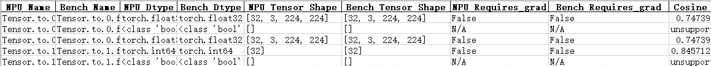

# PyTorch场景精度调试工具快速入门

## 概述

本文介绍PyTorch场景精度调试工具快速入门，主要针对训练开发流程中的模型精度调试环节使用的开发工具进行介绍。

基于昇腾开发的大模型或者是从GPU迁移到昇腾NPU环境的大模型，在训练过程中可能出现精度溢出、loss曲线跑飞或不收敛等异常问题。由于训练loss等指标无法精确定位问题模块，因此可以使用msProbe（MindStudio Probe，精度调试工具）进行快速定界。精度调试工具在下文均简称为msProbe。

**使用流程**

使用msProbe工具在模型精度调试中主要执行如下操作：

   1. 训练前配置检查

      识别两个环境影响精度的配置差异。

   2. 训练状态监测

      监测训练过程中计算，通信，优化器等部分出现的异常情况。

   3. 精度数据采集

      采集训练过程中的API或Module层级前反向输入输出数据。

   4. 精度预检

      扫描API数据，找出存在精度问题的API。

   5. 精度比对

      对比NPU侧和标杆环境的API数据，快速定位精度问题。

快速入门主要围绕精度数据采集和精度比对帮助用户快速上手，其他功能使用参见工具文档。

**环境准备**<a name="环境准备"></a>

1. 准备一台基于昇腾NPU的训练服务器（如Atlas A2 训练系列产品），并安装NPU驱动和固件。

2. 安装配套版本的CANN Toolkit开发套件包和ops算子包并配置CANN环境变量，以CANN 8.5.0版本为例，具体请参见《[CANN软件安装指南](https://www.hiascend.com/document/detail/zh/canncommercial/850/softwareinst/instg/instg_0000.html?Mode=PmIns&InstallType=local&OS=openEuler)》。

3. 安装框架。

   PyTorch训练场景以安装PyTorch 2.9.0、Python 3.12、系统架构AArch64、torchvision==0.24.0为例，具体操作请参见《[Ascend Extension for PyTorch 软件安装指南](https://www.hiascend.com/document/detail/zh/Pytorch/730/configandinstg/instg/insg_0001.html)》的“安装PyTorch > [方式一：二进制软件包安装](https://www.hiascend.com/document/detail/zh/Pytorch/730/configandinstg/instg/docs/zh/installation_guide/installation_via_binary_package.md)”章节。

4. 安装本工具，详情参考[msProbe工具安装指南](../msprobe_install_guide.md)。

   ```bash
   pip install mindstudio-probe --pre
   ```

## 精度数据采集

本样例选用ResNet50模型，采用虚拟数据训练，节省数据集下载时间。

**前提条件**

- 完成[环境准备](#环境准备)。

**执行采集**

1. 准备训练脚本。

   以“pytorch_main.py”命名为例，创建训练脚本文件，GPU和昇腾NPU环境可直接拷贝[PyTorch精度数据采集代码样例](#pytorch精度数据采集代码样例)的完整代码，其中GPU环境下执行训练时，脚本中不需要添加如下24、25行。

   ```python
    24 import torch_npu
    25 from torch_npu.contrib import transfer_to_npu
   ```

2. 创建配置文件。

   以在训练脚本所在目录创建config.json配置文件为例，文件内容拷贝如下示例配置。

   ```json
   {
       "task": "statistics",
       "dump_path": "/home/dump",
       "rank": [],
       "step": [0,1],
       "level": "L1",
       "async_dump": false,
   
       "statistics": {
           "scope": [], 
           "list": [],
           "tensor_list": [],
           "data_mode": ["all"],
           "summary_mode": "statistics"
       }
   }
   ```

3. 分别在GPU和昇腾NPU环境下的训练脚本（pytorch_main.py文件）中添加工具，如下所示。

   > [!NOTE] 说明
   >
   > [PyTorch精度数据采集代码样例](#pytorch精度数据采集代码样例)中的完整代码已添加工具，下列仅为说明工具接口在脚本中添加的位置。

   ```python
    26 # 导入工具数据采集接口，尽量在迭代训练文件导包后的位置执行seed_all和实例化PrecisionDebugger
    27 from msprobe.pytorch import PrecisionDebugger, seed_all
    28 seed_all(seed=1234, mode=True)    # 固定随机种子，开启确定性计算，保证每次模型执行数据均保持一致
   ...
   314 def train(train_loader, model, criterion, optimizer, epoch, device, args):
   ...
   331     end = time.time()
   
   332     debugger = PrecisionDebugger(config_path="./config.json")    # PrecisionDebugger实例化，加载dump配置文件
   
           # 数据集迭代的位置一般为模型训练开始的位置
   333     for i, (images, target) in enumerate(train_loader):
   334         debugger.start()  # 开启数据dump
   ...
   356
   357         # measure elapsed time
   358         batch_time.update(time.time() - end)
   359         end = time.time()
   360
   361         debugger.stop()    # 关闭数据dump，可继续开启数据dump，采集数据会记录在同一个step中
   362         debugger.step()    # 结束数据dump，若继续开启数据dump，采集数据将记录在下一个step中
   ```
   
   > [!NOTE] 说明
   >
   > 精度数据会占据一定的磁盘空间，可能存在磁盘写满导致服务器不可用的风险。精度数据所需空间跟模型的参数、采集开关配置、采集的迭代数量有较大关系，须用户自行保证落盘目录下的可用磁盘空间。
   
4. 执行训练脚本命令，工具会采集模型训练过程中的精度数据。

   ```bash
   python pytorch_main.py -a resnet50 -b 32 --gpu 1 --dummy
   ```

   日志打印出现如下信息即可手动停止模型训练查看采集数据，节省时间。

   ```txt
   ****************************************************************************
   *                        msprobe ends successfully.                        *
   ****************************************************************************
   ```

**结果查看**

dump_path参数指定的路径下会出现如下目录结构，可以根据需求选择合适的数据进行分析。

```txt
/home/dump/
├── step0
    └── proc3209296                  # 单卡训练中，训练进程没有rank信息，此时数据保存在proc{pid}，多卡场景下为rank{id}
        ├── construct.json           # 保存Module的层级关系信息，当前场景为空
        ├── dump.json                # 保存前反向API的输入输出的统计量信息和溢出信息等
        └── stack.json               # 保存API的调用栈信息
├── step1
...
```

采集后的数据需要用[精度比对](#精度比对)工具进行进一步分析。

## 精度比对

### compare精度比对

**前提条件**

- 完成[环境准备](#环境准备)。
- 完成[精度数据采集](#精度数据采集)，得到GPU和昇腾NPU环境的精度数据。

**执行比对**

1. 数据准备。

   完成前提条件中GPU和昇腾NPU环境的数据dump后，将GPU环境下dump的精度数据拷贝至昇腾NPU环境。注意区分dump_path指定的目录名称，以dump_data_npu和dump_data_gpu为例。

   dump_data_gpu目录下dump.json路径为`/home/dump/dump_data_gpu/step0/rank/dump.json`。

   dump_data_npu目录下dump.json路径为`/home/dump/dump_data_npu/step0/rank/dump.json`。

2. 执行比对。

   命令如下：

   ```bash
   msprobe compare -tp /home/dump/dump_data_npu/step0/rank/dump.json -gp /home/dump/dump_data_gpu/step0/rank/dump.json -o /home/accuracy_compare
   ```

   出现如下打印说明比对成功：

   ```txt
   ...
   The result excel file path is: /home/accuracy_compare/compare_result_{timestamp}.xlsx
   ************************************************************************************
   *                        msprobe compare ends successfully.                        *
   ************************************************************************************
   ```
   
3. 比对结果文件分析。

   compare会在/home/accuracy_compare生成如下文件。

   compare_result_{timestamp}.xlsx：文件列出了所有执行精度比对的API详细信息和比对结果，可通过比对结果（Result）、错误信息提示（Err_Message）定位可疑算子，但鉴于每种指标都有对应的判定标准，还需要结合实际情况进行判断。

   示例如下：

   **图1** compare_result_1

   

   **图2** compare_result_2

   

   **图3** compare_result_3
   
   
   
   更多比对结果分析请参见“[精度比对结果分析](../accuracy_compare/pytorch_accuracy_compare_instruct.md#精度比对结果分析)”。

### 分级可视化构图比对

**前提条件**

- 完成[环境准备](#环境准备)。

- 完成[精度数据采集](#精度数据采集)，得到GPU和昇腾NPU环境的精度数据。

  分级可视化构图要求dump数据时config.json配置文件的"level"参数配置为"L0"或"mix"，本样例以配置"mix"为例，重新采集精度数据。
  
**执行比对**

1. 数据准备。

   完成前提条件中GPU和昇腾NPU环境的数据dump后，将GPU环境下dump的精度数据拷贝至昇腾NPU环境。注意区分dump_path指定的目录名称，以dump_data_npu和dump_data_gpu为例。

   dump_data_gpu目录路径为`/home/dump/dump_data_gpu/step1`。

   dump_data_npu目录路径为`/home/dump/dump_data_npu/step1`。

2. 执行图构建比对。

   ```bash
   msprobe graph_visualize -tp /home/dump/dump_data_npu/step1 -gp /home/dump/dump_data_gpu/step1 -o /home/dump/output
   ```

   比对完成后在/home/dump/output下生成一个`.vis.db`后缀的文件。

3. 启动TensorBoard。

   ```bash
   tensorboard --logdir ./output --bind_all
   ```

   --logdir指定的路径即为步骤2中的/home/dump/output路径。

   执行以上命令后打印如下日志。

   ```txt
   TensorBoard 2.20.0 at http://ubuntu:6006/ (Press CTRL+C to quit)
   ```

   需要在Windows环境下打开浏览器，访问地址`http://ubuntu:6006/`，其中ubuntu修改为服务器的IP地址，例如`http://192.168.1.10:6006/`。

   访问地址成功后页面显示TensorBoard界面，如下所示。

   **图1** 分级可视化构图比对

   

## 代码样例

### PyTorch精度数据采集代码样例

```python
import argparse
import os
import random
import shutil
import time
import warnings
from enum import Enum

import torch
import torch.backends.cudnn as cudnn
import torch.distributed as dist
import torch.multiprocessing as mp
import torch.nn as nn
import torch.nn.parallel
import torch.optim
import torch.utils.data
import torch.utils.data.distributed
import torchvision.datasets as datasets
import torchvision.models as models
import torchvision.transforms as transforms
from torch.optim.lr_scheduler import StepLR
from torch.utils.data import Subset

import torch_npu
from torch_npu.contrib import transfer_to_npu

from msprobe.pytorch import PrecisionDebugger, seed_all
seed_all(seed=1234, mode=True)  # 固定随机种子，开启确定性计算，保证每次模型执行数据均保持一致

model_names = sorted(name for name in models.__dict__
    if name.islower() and not name.startswith("__")
    and callable(models.__dict__[name]))

parser = argparse.ArgumentParser(description='PyTorch ImageNet Training')
parser.add_argument('data', metavar='DIR', nargs='?', default='imagenet',
                    help='path to dataset (default: imagenet)')
parser.add_argument('-a', '--arch', metavar='ARCH', default='resnet18',
                    choices=model_names,
                    help='model architecture: ' +
                        ' | '.join(model_names) +
                        ' (default: resnet18)')
parser.add_argument('-j', '--workers', default=4, type=int, metavar='N',
                    help='number of data loading workers (default: 4)')
parser.add_argument('--epochs', default=90, type=int, metavar='N',
                    help='number of total epochs to run')
parser.add_argument('--start-epoch', default=0, type=int, metavar='N',
                    help='manual epoch number (useful on restarts)')
parser.add_argument('-b', '--batch-size', default=256, type=int,
                    metavar='N',
                    help='mini-batch size (default: 256), this is the total '
                         'batch size of all GPUs on the current node when '
                         'using Data Parallel or Distributed Data Parallel')
parser.add_argument('--lr', '--learning-rate', default=0.1, type=float,
                    metavar='LR', help='initial learning rate', dest='lr')
parser.add_argument('--momentum', default=0.9, type=float, metavar='M',
                    help='momentum')
parser.add_argument('--wd', '--weight-decay', default=1e-4, type=float,
                    metavar='W', help='weight decay (default: 1e-4)',
                    dest='weight_decay')
parser.add_argument('-p', '--print-freq', default=10, type=int,
                    metavar='N', help='print frequency (default: 10)')
parser.add_argument('--resume', default='', type=str, metavar='PATH',
                    help='path to latest checkpoint (default: none)')
parser.add_argument('-e', '--evaluate', dest='evaluate', action='store_true',
                    help='evaluate model on validation set')
parser.add_argument('--pretrained', dest='pretrained', action='store_true',
                    help='use pre-trained model')
parser.add_argument('--world-size', default=-1, type=int,
                    help='number of nodes for distributed training')
parser.add_argument('--rank', default=-1, type=int,
                    help='node rank for distributed training')
parser.add_argument('--dist-url', default='tcp://224.66.41.62:23456', type=str,
                    help='url used to set up distributed training')
parser.add_argument('--dist-backend', default='nccl', type=str,
                    help='distributed backend')
parser.add_argument('--seed', default=None, type=int,
                    help='seed for initializing training. ')
parser.add_argument('--gpu', default=None, type=int,
                    help='GPU id to use.')
parser.add_argument('--no-accel', action='store_true',
                    help='disables accelerator')
parser.add_argument('--multiprocessing-distributed', action='store_true',
                    help='Use multi-processing distributed training to launch '
                         'N processes per node, which has N GPUs. This is the '
                         'fastest way to use PyTorch for either single node or '
                         'multi node data parallel training')
parser.add_argument('--dummy', action='store_true', help="use fake data to benchmark")

best_acc1 = 0


def main():
    args = parser.parse_args()

    if args.seed is not None:
        random.seed(args.seed)
        torch.manual_seed(args.seed)
        cudnn.deterministic = True
        cudnn.benchmark = False
        warnings.warn('You have chosen to seed training. '
                      'This will turn on the CUDNN deterministic setting, '
                      'which can slow down your training considerably! '
                      'You may see unexpected behavior when restarting '
                      'from checkpoints.')

    if args.gpu is not None:
        warnings.warn('You have chosen a specific GPU. This will completely '
                      'disable data parallelism.')

    if args.dist_url == "env://" and args.world_size == -1:
        args.world_size = int(os.environ["WORLD_SIZE"])

    args.distributed = args.world_size > 1 or args.multiprocessing_distributed

    use_accel = not args.no_accel and torch.accelerator.is_available()

    if use_accel:
        device = torch.accelerator.current_accelerator()
    else:
        device = torch.device("cpu")

    print(f"Using device: {device}")

    if device.type =='cuda':
        ngpus_per_node = torch.accelerator.device_count()
        if ngpus_per_node == 1 and args.dist_backend == "nccl":
            warnings.warn("nccl backend >=2.5 requires GPU count>1, see https://github.com/NVIDIA/nccl/issues/103 perhaps use 'gloo'")
    else:
        ngpus_per_node = 1

    if args.multiprocessing_distributed:
        # Since we have ngpus_per_node processes per node, the total world_size
        # needs to be adjusted accordingly
        args.world_size = ngpus_per_node * args.world_size
        # Use torch.multiprocessing.spawn to launch distributed processes: the
        # main_worker process function
        mp.spawn(main_worker, nprocs=ngpus_per_node, args=(ngpus_per_node, args))
    else:
        # Simply call main_worker function
        main_worker(args.gpu, ngpus_per_node, args)


def main_worker(gpu, ngpus_per_node, args):
    global best_acc1
    args.gpu = gpu

    use_accel = not args.no_accel and torch.accelerator.is_available()

    if use_accel:
        if args.gpu is not None:
            torch.accelerator.set_device_index(args.gpu)
        device = torch.accelerator.current_accelerator()
    else:
        device = torch.device("cpu")

    if args.distributed:
        if args.dist_url == "env://" and args.rank == -1:
            args.rank = int(os.environ["RANK"])
        if args.multiprocessing_distributed:
            # For multiprocessing distributed training, rank needs to be the
            # global rank among all the processes
            args.rank = args.rank * ngpus_per_node + gpu
        dist.init_process_group(backend=args.dist_backend, init_method=args.dist_url,
                                world_size=args.world_size, rank=args.rank)
    # create model
    if args.pretrained:
        print("=> using pre-trained model '{}'".format(args.arch))
        model = models.__dict__[args.arch](pretrained=True)
    else:
        print("=> creating model '{}'".format(args.arch))
        model = models.__dict__[args.arch]()

    if not use_accel:
        print('using CPU, this will be slow')
    elif args.distributed:
        # For multiprocessing distributed, DistributedDataParallel constructor
        # should always set the single device scope, otherwise,
        # DistributedDataParallel will use all available devices.
        if device.type == 'cuda':
            if args.gpu is not None:
                torch.cuda.set_device(args.gpu)
                model.cuda(device)
                # When using a single GPU per process and per
                # DistributedDataParallel, we need to divide the batch size
                # ourselves based on the total number of GPUs of the current node.
                args.batch_size = int(args.batch_size / ngpus_per_node)
                args.workers = int((args.workers + ngpus_per_node - 1) / ngpus_per_node)
                model = torch.nn.parallel.DistributedDataParallel(model, device_ids=[args.gpu])
            else:
                model.cuda()
                # DistributedDataParallel will divide and allocate batch_size to all
                # available GPUs if device_ids are not set
                model = torch.nn.parallel.DistributedDataParallel(model)
    elif device.type == 'cuda':
        # DataParallel will divide and allocate batch_size to all available GPUs
        if args.arch.startswith('alexnet') or args.arch.startswith('vgg'):
            model.features = torch.nn.DataParallel(model.features)
            model.cuda()
        else:
            model = torch.nn.DataParallel(model).cuda()
    else:
        model.to(device)


    # define loss function (criterion), optimizer, and learning rate scheduler
    criterion = nn.CrossEntropyLoss().to(device)

    optimizer = torch.optim.SGD(model.parameters(), args.lr,
                                momentum=args.momentum,
                                weight_decay=args.weight_decay)

    """Sets the learning rate to the initial LR decayed by 10 every 30 epochs"""
    scheduler = StepLR(optimizer, step_size=30, gamma=0.1)

    # optionally resume from a checkpoint
    if args.resume:
        if os.path.isfile(args.resume):
            print("=> loading checkpoint '{}'".format(args.resume))
            if args.gpu is None:
                checkpoint = torch.load(args.resume)
            else:
                # Map model to be loaded to specified single gpu.
                loc = f'{device.type}:{args.gpu}'
                checkpoint = torch.load(args.resume, map_location=loc)
            args.start_epoch = checkpoint['epoch']
            best_acc1 = checkpoint['best_acc1']
            if args.gpu is not None:
                # best_acc1 may be from a checkpoint from a different GPU
                best_acc1 = best_acc1.to(args.gpu)
            model.load_state_dict(checkpoint['state_dict'])
            optimizer.load_state_dict(checkpoint['optimizer'])
            scheduler.load_state_dict(checkpoint['scheduler'])
            print("=> loaded checkpoint '{}' (epoch {})"
                  .format(args.resume, checkpoint['epoch']))
        else:
            print("=> no checkpoint found at '{}'".format(args.resume))


    # Data loading code
    if args.dummy:
        print("=> Dummy data is used!")
        train_dataset = datasets.FakeData(1281167, (3, 224, 224), 1000, transforms.ToTensor())
        val_dataset = datasets.FakeData(50000, (3, 224, 224), 1000, transforms.ToTensor())
    else:
        traindir = os.path.join(args.data, 'train')
        valdir = os.path.join(args.data, 'val')
        normalize = transforms.Normalize(mean=[0.485, 0.456, 0.406],
                                     std=[0.229, 0.224, 0.225])

        train_dataset = datasets.ImageFolder(
            traindir,
            transforms.Compose([
                transforms.RandomResizedCrop(224),
                transforms.RandomHorizontalFlip(),
                transforms.ToTensor(),
                normalize,
            ]))

        val_dataset = datasets.ImageFolder(
            valdir,
            transforms.Compose([
                transforms.Resize(256),
                transforms.CenterCrop(224),
                transforms.ToTensor(),
                normalize,
            ]))

    if args.distributed:
        train_sampler = torch.utils.data.distributed.DistributedSampler(train_dataset)
        val_sampler = torch.utils.data.distributed.DistributedSampler(val_dataset, shuffle=False, drop_last=True)
    else:
        train_sampler = None
        val_sampler = None

    train_loader = torch.utils.data.DataLoader(
        train_dataset, batch_size=args.batch_size, shuffle=(train_sampler is None),
        num_workers=args.workers, pin_memory=True, sampler=train_sampler)

    val_loader = torch.utils.data.DataLoader(
        val_dataset, batch_size=args.batch_size, shuffle=False,
        num_workers=args.workers, pin_memory=True, sampler=val_sampler)

    if args.evaluate:
        validate(val_loader, model, criterion, args)
        return

    for epoch in range(args.start_epoch, args.epochs):
        if args.distributed:
            train_sampler.set_epoch(epoch)

        # train for one epoch
        train(train_loader, model, criterion, optimizer, epoch, device, args)

        # evaluate on validation set
        acc1 = validate(val_loader, model, criterion, args)

        scheduler.step()

        # remember best acc@1 and save checkpoint
        is_best = acc1 > best_acc1
        best_acc1 = max(acc1, best_acc1)

        if not args.multiprocessing_distributed or (args.multiprocessing_distributed
                and args.rank % ngpus_per_node == 0):
            save_checkpoint({
                'epoch': epoch + 1,
                'arch': args.arch,
                'state_dict': model.state_dict(),
                'best_acc1': best_acc1,
                'optimizer' : optimizer.state_dict(),
                'scheduler' : scheduler.state_dict()
            }, is_best)

def train(train_loader, model, criterion, optimizer, epoch, device, args):

    use_accel = not args.no_accel and torch.accelerator.is_available()

    batch_time = AverageMeter('Time', use_accel, ':6.3f', Summary.NONE)
    data_time = AverageMeter('Data', use_accel, ':6.3f', Summary.NONE)
    losses = AverageMeter('Loss', use_accel, ':.4e', Summary.NONE)
    top1 = AverageMeter('Acc@1', use_accel, ':6.2f', Summary.NONE)
    top5 = AverageMeter('Acc@5', use_accel, ':6.2f', Summary.NONE)
    progress = ProgressMeter(
        len(train_loader),
        [batch_time, data_time, losses, top1, top5],
        prefix="Epoch: [{}]".format(epoch))

    # switch to train mode
    model.train()

    end = time.time()
    debugger = PrecisionDebugger(config_path="./config.json")
    for i, (images, target) in enumerate(train_loader):
        debugger.start()
        # measure data loading time
        data_time.update(time.time() - end)

        # move data to the same device as model
        images = images.to(device, non_blocking=True)
        target = target.to(device, non_blocking=True)

        # compute output
        output = model(images)
        loss = criterion(output, target)

        # measure accuracy and record loss
        acc1, acc5 = accuracy(output, target, topk=(1, 5))
        losses.update(loss.item(), images.size(0))
        top1.update(acc1[0], images.size(0))
        top5.update(acc5[0], images.size(0))

        # compute gradient and do SGD step
        optimizer.zero_grad()
        loss.backward()
        optimizer.step()

        # measure elapsed time
        batch_time.update(time.time() - end)
        end = time.time()

        debugger.stop()
        debugger.step()

        if i % args.print_freq == 0:
            progress.display(i + 1)


def validate(val_loader, model, criterion, args):

    use_accel = not args.no_accel and torch.accelerator.is_available()

    def run_validate(loader, base_progress=0):

        if use_accel:
            device = torch.accelerator.current_accelerator()
        else:
            device = torch.device("cpu")

        with torch.no_grad():
            end = time.time()
            for i, (images, target) in enumerate(loader):
                i = base_progress + i
                if use_accel:
                    if args.gpu is not None and device.type=='cuda':
                        torch.accelerator.set_device_index(argps.gpu)
                        images = images.cuda(args.gpu, non_blocking=True)
                        target = target.cuda(args.gpu, non_blocking=True)
                    else:
                        images = images.to(device)
                        target = target.to(device)

                # compute output
                output = model(images)
                loss = criterion(output, target)

                # measure accuracy and record loss
                acc1, acc5 = accuracy(output, target, topk=(1, 5))
                losses.update(loss.item(), images.size(0))
                top1.update(acc1[0], images.size(0))
                top5.update(acc5[0], images.size(0))

                # measure elapsed time
                batch_time.update(time.time() - end)
                end = time.time()

                if i % args.print_freq == 0:
                    progress.display(i + 1)

    batch_time = AverageMeter('Time', use_accel, ':6.3f', Summary.NONE)
    losses = AverageMeter('Loss', use_accel, ':.4e', Summary.NONE)
    top1 = AverageMeter('Acc@1', use_accel, ':6.2f', Summary.AVERAGE)
    top5 = AverageMeter('Acc@5', use_accel, ':6.2f', Summary.AVERAGE)
    progress = ProgressMeter(
        len(val_loader) + (args.distributed and (len(val_loader.sampler) * args.world_size < len(val_loader.dataset))),
        [batch_time, losses, top1, top5],
        prefix='Test: ')

    # switch to evaluate mode
    model.eval()

    run_validate(val_loader)
    if args.distributed:
        top1.all_reduce()
        top5.all_reduce()

    if args.distributed and (len(val_loader.sampler) * args.world_size < len(val_loader.dataset)):
        aux_val_dataset = Subset(val_loader.dataset,
                                 range(len(val_loader.sampler) * args.world_size, len(val_loader.dataset)))
        aux_val_loader = torch.utils.data.DataLoader(
            aux_val_dataset, batch_size=args.batch_size, shuffle=False,
            num_workers=args.workers, pin_memory=True)
        run_validate(aux_val_loader, len(val_loader))

    progress.display_summary()

    return top1.avg


def save_checkpoint(state, is_best, filename='checkpoint.pth.tar'):
    torch.save(state, filename)
    if is_best:
        shutil.copyfile(filename, 'model_best.pth.tar')

class Summary(Enum):
    NONE = 0
    AVERAGE = 1
    SUM = 2
    COUNT = 3

class AverageMeter(object):
    """Computes and stores the average and current value"""
    def __init__(self, name, use_accel, fmt=':f', summary_type=Summary.AVERAGE):
        self.name = name
        self.use_accel = use_accel
        self.fmt = fmt
        self.summary_type = summary_type
        self.reset()

    def reset(self):
        self.val = 0
        self.avg = 0
        self.sum = 0
        self.count = 0

    def update(self, val, n=1):
        self.val = val
        self.sum += val * n
        self.count += n
        self.avg = self.sum / self.count

    def all_reduce(self):    
        if use_accel:
            device = torch.accelerator.current_accelerator()
        else:
            device = torch.device("cpu")
        total = torch.tensor([self.sum, self.count], dtype=torch.float32, device=device)
        dist.all_reduce(total, dist.ReduceOp.SUM, async_op=False)
        self.sum, self.count = total.tolist()
        self.avg = self.sum / self.count

    def __str__(self):
        fmtstr = '{name} {val' + self.fmt + '} ({avg' + self.fmt + '})'
        return fmtstr.format(**self.__dict__)

    def summary(self):
        fmtstr = ''
        if self.summary_type is Summary.NONE:
            fmtstr = ''
        elif self.summary_type is Summary.AVERAGE:
            fmtstr = '{name} {avg:.3f}'
        elif self.summary_type is Summary.SUM:
            fmtstr = '{name} {sum:.3f}'
        elif self.summary_type is Summary.COUNT:
            fmtstr = '{name} {count:.3f}'
        else:
            raise ValueError('invalid summary type %r' % self.summary_type)

        return fmtstr.format(**self.__dict__)


class ProgressMeter(object):
    def __init__(self, num_batches, meters, prefix=""):
        self.batch_fmtstr = self._get_batch_fmtstr(num_batches)
        self.meters = meters
        self.prefix = prefix

    def display(self, batch):
        entries = [self.prefix + self.batch_fmtstr.format(batch)]
        entries += [str(meter) for meter in self.meters]
        print('\t'.join(entries))

    def display_summary(self):
        entries = [" *"]
        entries += [meter.summary() for meter in self.meters]
        print(' '.join(entries))

    def _get_batch_fmtstr(self, num_batches):
        num_digits = len(str(num_batches // 1))
        fmt = '{:' + str(num_digits) + 'd}'
        return '[' + fmt + '/' + fmt.format(num_batches) + ']'

def accuracy(output, target, topk=(1,)):
    """Computes the accuracy over the k top predictions for the specified values of k"""
    with torch.no_grad():
        maxk = max(topk)
        batch_size = target.size(0)

        _, pred = output.topk(maxk, 1, True, True)
        pred = pred.t()
        correct = pred.eq(target.view(1, -1).expand_as(pred))

        res = []
        for k in topk:
            correct_k = correct[:k].reshape(-1).float().sum(0, keepdim=True)
            res.append(correct_k.mul_(100.0 / batch_size))
        return res


if __name__ == '__main__':
    main()
```
